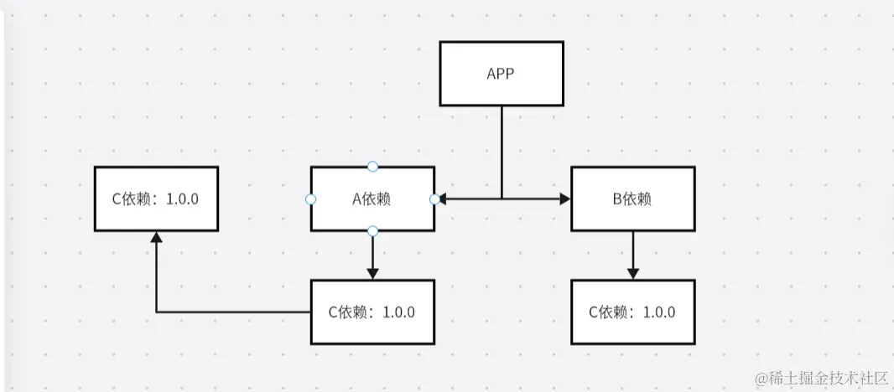
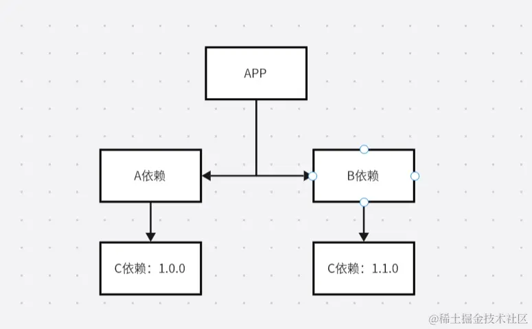
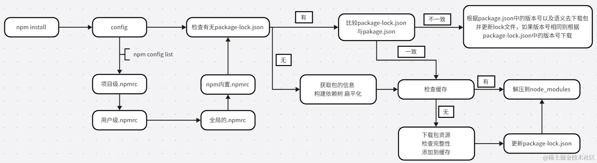
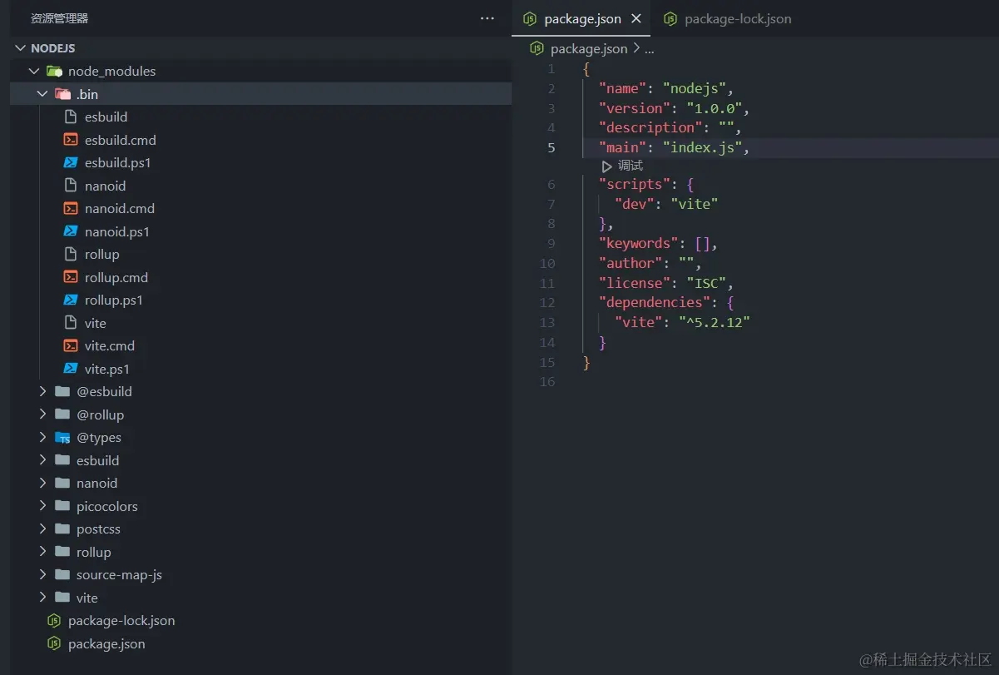
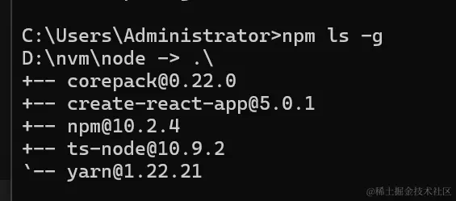
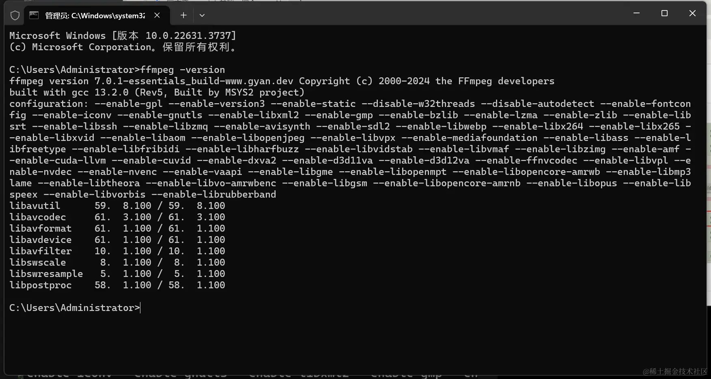

## package.json 与 npm

当我们安装好 nodejs 后，我们就可以使用 npm、npx

全称：Node Packge Manager，是 nodejs 的包管理工具，是一个基于命令行的工具，用于帮助开发者在项目中安装、升级、卸载和管理依赖项。

**npm 命令**

- `npm init`：初始化一个 npm 项目，创建 package.json 文件。
- `npm install`：安装一个包或者一组包，并且会在当前目录存放一个 node_modules。
- `npm install <package-name>`：安装指定的包。
- `npm install <package-name> --save`：安装指定的包，将其添加到依赖列表中。
- `npm install <package-name> --save-dev`：安装指定的包，将其添加到开发依赖列表中。
- `npm install -g <package-name>`：全局安装指定的包。
- `npm update <package-name>`：更新指定的包。
- `npm uninstall <package-name>`：卸载指定的包。
- `npm run <script-name>`：执行文件中定义的脚本命令。
- `npm search <keyword>`：搜索 npm 库中包含指定关键字的包。
- `npm info <package-name>`：查看指定包的详细信息。
- `npm list`：列出当前项目中所安装的包。
- `npm outdated`：列出当前项目中需要更新的包。
- `npm audit`：检查当前项目中的依赖是否存在安全漏洞。
- `npm publish`：发布自己开发的包到 npm 库中。
- `npm login`：登录 npm 账户。
- `npm logout`：注销当前 npm 账户。
- `npm link`：将本地模块连接到全局的 node_modules 目录下。
- `npm config list`：用于列出所有 npm 配置信息。执行该命令可以查看当前系统和用户级别的所有 npm 配置信息以及当前项目的配置信息（在该项目目录下执行）。
- `npm get registry`：用于获取当前 npm 配置中的 registry 配置项的值，registry 配置项用于指定 npm 包的下载地址，如果未指定，则默认使用 npm 官方的包注册地址。
- `npm set regidtry npm config set registry <registry-url>`：将 registry 配置项的值修改为指定`<registry-url>`地址。

**package.json**

- `name`：项目名称，必须是唯一的字符串，通常采用小写字母和连字符的组合。
- `version`：项目版本号，通常采用语义化版本号规范，大版本号，次版本号，修订号。
- `description`：项目描述。
- `main`：项目的主入口文件路径，通常是一个 JavaScript 文件。
- `keywords`：项目的关键字列表，方便他人搜索。
- `author`：项目作者的信息。
- `license`：项目的许可类型，可以是自定义的许可类型或者开源许可（MIT、Apache 等）。
- `dependencies`：项目所依赖包的列表，这些包会在项目运行时自动安装。
- `devDependencies`：项目开发中需要的包列表，这些包不会随项目一起发布，只在开发时使用。
- `peerDependencies`：项目的同级依赖，即项目所需的模块被其他模块所依赖，如开发一个 vite 插件，vite 插件是依赖于 vite 的，这时 vite 包就需要安装在此。
- `scripts`：定义脚本命令，如启动项目，打包等。
- `repository`：项目代码仓库的信息，包括类型、网址等。
- `bugs`：项目 bug 报告地址。
- `homepage`：项目的官网或者文档地址。

**npm install 原理**

在执行 npm install 时发生了什么？

> 安装的依赖都会存放在 node_modulesmul，默认采用扁平化的方式安装；排序规则：.bin 等系列然后@系列最后按照字母顺序；使用的算法是广度优先遍历，在遍历依赖树时，会先处理根目录下的依赖，再逐层处理依赖包的依赖，直至所有依赖处理完毕；在处理依赖时，npm 会检查该依赖的版本号是否符合依赖树中其他依赖的版本要求，如果不符合则会安装合适的版本。

**扁平化**

> 扁平化理想状态如下：当我们安装 B 依赖时，它所依赖的 C 已经在安装 A 依赖时安装了，且版本一致，B 依赖就会直接复用 C。因为 A 模块下的 C 模块被安装到了第一级，这使得 B 模块能够复用处在同一级下；且名称，版本，均相同的 C 模块



> 非理想状态如下：当 A、B 所依赖的模块不同（版本不同），这时就不同复用模板，就会出现模块冗余的情况，它就会给 B 添加一层 node_nodules



**npm install 流程**



**npmrc 的一些配置**

```sh
registry=http://registry.npmjs.org/
# 定义npm的registry，即npm的包下载源

proxy=http://proxy.example.com:8080/
# 定义npm的代理服务器，用于访问网络

https-proxy=http://proxy.example.com:8080/
# 定义npm的https代理服务器，用于访问网络

strict-ssl=true
# 是否在SSL证书验证错误时退出

cafile=/path/to/cafile.pem
# 定义自定义CA证书文件的路径

user-agent=npm/{npm-version} node/{node-version} {platform}
# 自定义请求头中的User-Agent

save=true
# 安装包时是否自动保存到package.json的dependencies中

save-dev=true
# 安装包时是否自动保存到package.json的devDependencies中

save-exact=true
# 安装包时是否精确保存版本号

engine-strict=true
# 是否在安装时检查依赖的node和npm版本是否符合要求

scripts-prepend-node-path=true
# 是否在运行脚本时自动将node的路径添加到PATH环境变量中
```

**package-lock.json 的作用**
可以锁定版本记录依赖树详细信息

- `version`：指定当前包的版本号
- `resolves`：指定当前包的下载地址
- `integrity`：用于验证包的完整性
- `dev`：指定当前包是一个开发依赖
- `bin`：指定当前包中可执行文件的路径和名称
- `engines`：指定当前包所依赖的 nodejs 版本范围

> package-lock.json 帮我们做了缓存，它会通过`name + version + integrity`生成一个唯一的 key，这个 key 能找到对应的 index-v5 下的缓存记录

**npm run 原理**
在下面的 npm run dev 发生了什么？



> 读取 package.json 的 scripts 中对应的脚本命令，查找规则是：

- 先在当前目录的 node_modules/.bin 中去查找
- 没有就去全局的 node_modules 寻找
- 还没有就到环境变量中查找
- 再找不到就会报错

> nodejs 是跨平台的，所以可执行命令兼容各个平台

- .sh 文件是给 Linux unix Macos 使用
- .cmd 是给 windows 的 cmd 使用
- .ps1 给 windows 的 powerShell 使用
  **npm 生命周期**

```json
"scripts": {
    "predev": "node prev.js",
    "dev": "node index.js",
    "postdev": "node post.js"
  },
```

在上述 json 文件中执行 npm run dev 时会先执行 predev，再执行 dev，最后执行 postdev

**npx**：

> 是一个命令行工具，它是 npm5.2.0 版本新增的功能。它允许用户在不安装全局包的情况下运行已安装在本地项目中的包或者远程仓库中的包。作用：在命令行中运行 node 包中的可执行文件，而不需要安装这些包，有效的避免全局污染，在使用不同版本时不会出现版本冲突

**npx 优势**

- 避免全局安装：`npx`允许执行 npm package 而不需要全局安装
- 总是使用最新版本：当你本地没有安装相应的 npm package，`npx`会从 npm 的 package 仓库中下载并使用最新版本
- 执行任意 npm 包：`npx`不仅可以执行在 package.json 的 scripts 定义的命令，还可以执行任何 npm package
- 执行 Github gist：`npx`可以执行`Github gist`或者其他公开的 JavaScript 文件

**npm 与 npx 的区别**

`npx`侧重于执行命令，执行某个命令，虽然会自动安装，但是重在执行某个命令

`npm`侧重于安装或卸载某个模块，重在安装，不具备执行某个模块的功能

**示例**

> 当我们要创建一个 react 项目时，需要使用 npm 把`create-react-app`安装到全局，然后执行 create-react-app '项目名'。



这样就会有两个问题

- 首先需要全局安装这个包占用磁盘空间
- 并且如果需要更新还要执行更新命令

> 当我全局没有安装 vite，但是某个项目中安装了 vite，就可以在这个项目的根目录中执行 npx vite。运行规则：本地目录查找.bin 有没有，没有就去全局的 node_modules 中查找，还没有就去下载这个包然后运行命令，然后删除这个包

## 模块化

nodejs 模块化遵循两套规范：CommonJS 和 esm

**CommonJS 规范**

> 引入模块（require），使用时在 package.json 中设置 type:commonjs

- 支持引入内置模块，如：http、os、fs、child_process 等 nodejs 模块
- 支持引入第三方模块：express、md5、koa 等
- 支持引入自己编写的模块
- 支持引入 addon C++扩展.node 文件

```js
const fs = require("node:fs");
const koa = require("koa");
const module = require("./module");
const moduleNode = require("./module.node");
```

导出模块 exports module.exports

```js
//导出对象
module.exports = {
  fn: function () {},
};
//直接导出
module.exports = "直接导出";
```

**ESM 规范**

> 引入模块`import`必须写在顶部，使用时在 package.json 中设置 type:module

```js
import fs from "node:fs";
//加载模块的整体对象
import * as all from "xx.js";
```

> 如果要引入 json 文件需要特殊处理 需要增加断言并且指定类型 json node 低版本不支持

```js
import info from "./info.json" assert { type: "json" };
```

> 导出模块，默认对象`default`只能有一个，不能重复

```js
export default {
  name: "text",
};

export const num = 1;
```

**CommonJS 与 ESM 的区别**

- CommonJS 是基于运行时的同步加载（缺点：会阻塞后面代码执行），ESM 是基于编译时的异步加载（如果想在逻辑中使用 import，就需要使用 import()函数模式）
- CommonJS 是可以修改值的，ESM 值不可修改
- CommonJS 不可以 tree shaking，ESM 支持
- CommonJS 顶层 this 指向这个模块本身，ESM 顶层 this 指向 undefined

## 全局变量

> 在 nodejs 中使用 global 定义全局变量，在浏览器中定义的全局变量都在 window，nodejs 在 global，ECMAScript2020 中有了`golbalThis`，会根据当前环境自动切换为 window 或 global。

**其他全局 API**

> 在浏览器中有 DOM、BOM、ECMAScript，node 中就只有 ECMAScript

**nodejs 内置全局 API**

- `__dirname`：表示当前模块所在目录的绝对路劲
- `__filename`：表示当前模块的绝对路径，包括文件名和文件扩展名
- `process.argv`：是一个包含命令行参数的数组，第一个元素是 nodejs 的执行路径，第二个元素是当前执行的 javascript 文件路径，之后的元素是传递给脚本的命令行参数
- `process.env`：一个包含当前环境变量的对象，可以通过它访问并操作环境变量
- `process.cwd()`：这个方法返回当前工作目录的路径
- `process.on(event,listener)`：用于注册事件监听器，可以使用`process.on`监听`exit`、`uncaughtException`等事件，并在事件发生时执行相应的`callback`
- `process.exit([code])`：用于退出当前的 nodejs 进程，可以提供一个可选的退出码作为参数
- `process.pid`：返回当前进程的 PID（进程 ID）

> `process`对象还有其他许多属性和方法，可以用于监控进程、设置信号处理、发送 IPC 消息等。它是一个全局对象，可以在任何模块中直接访问

**Buffer**

- 创建 Buffer 实例：
  - `Buffer.alloc(size[,fill[,encoding]])`：创建一个指定大小的 Buffer 实例，初始内容为零。`fill`参数可用于填充缓冲区，`encoding`参数指定填充的字符串编码
  - `Buffer.from(array)`：创建一个包含给定数组的`Buffer`实例
  - `Buffer.from(string[,]encoding)`：创建一个给的字符串的`Buffer`实例
- 读取与写入数据：
  - `buffer[index]`：通过索引读取或写入`Buffer`实例中的特定字节
  - `buffer.length`：获取`Buffer`实例的字节长度
  - `buffer.toString([encoding[,start[,end]])`：将`Buffer`实例传为字符串。
- 转换数据：
  - `buffer.toJSON()`：将`Buffer`实例传为 JSON 对象。
  - `buffer.slice([start[,end]])`：返回一个新的`Buffer`实例，其中包含原始`Buffer`实例的部分内容
- 其他方法： - `Buffer.isBuffer(obj)`：检测对象是否是`Buffer`实例 - `Buffer.concat(list[,totalLength])`：将一组`Buffer`实例或字节数组连接起来形成一个新的`Buffer`实例
  > 注：从 nodejs6.0 版本开始，`Buffer`构造函数已被弃用，推荐使用`Buffer.alloc()`，`Buffer`经常用在处理文件、网络通信、加密解密等操作中，尤其是处理二进制数据时。

## CSR SSR SEO

> 如果我们需要在 node 环境操作 DOM 和 BOM，就可以借助第三方库：`jsdom`

案例：

```js
const fs = require("node:fs");
const { JSDOM } = require("jsdom");

const dom = new JSDOM(`
<!DOCTYPE html>
<html lang="en">
  <head>
    <meta charset="UTF-8" />
    <meta name="viewport" content="width=device-width, initial-scale=1.0" />
    <title>Document</title>
  </head>
  <body>
    <div id="app"></div>
  </body>
</html>`);
const document = dom.window.document;
fetch("https://api.thecatapi.com/v1/images/search?limit=10&page=1")
  .then((red) => red.json())
  .then((data) => {
    const app = document.getElementById("app");
    data.forEach((item) => {
      const img = document.createElement("img");
      img.src = item.url;
      img.style.width = "300px";
      img.style.height = "300px";
      app.appendChild(img);
    });
    fs.writeFileSync("./index1.html", dom.serialize());
  });
```

> 上述操作属于`SSR（Server-Side Rendering）`，在服务端完成请求和拼装，像我们平时的 Vue，React 框架（不包括 nuxtjs、nextjs）都是属于`CSR（Client-Side Rendering）`客户端渲染

**CSR 和 SSR 的区别**

- 页面加载方式：
  - CSR：在 CSR 中，服务器返回一个初始的 HTM 页面，然后再浏览器下载执行 JavaScript 文件，JavaScript 负责动态生成并更新页面内容。这意味着初始页面加载时，内容较少，页面结构和样式可能存在一定的延迟
  - SSR：在 SSR 中，服务器在返回给浏览器之前，回预先在服务器生成完整的 HTML 页面，包含初始页面内容。浏览器接收到是已经渲染好的 HTML 页面，初始加载速度会更快
- 内容生成和渲染：
  - CSR：在 CSR 中，页面的内容生成和渲染是由客户端的 JavaScript 脚本负责，当数据变化时，JavaScript 会重新生成并更新 DOM，实现内容的动态变化。
  - SSR:在 SSR 中，服务器在渲染页面时会执行应用程序的代码并生成最终的 HTML 页面，这些内容是由服务器生成，对于一些静态或少变得内容，可以提供更好的首次加载性能
- 用户交互和体验：
  - CSR:在 CSR 中，一旦初始页面加载完成，后续的用户交互通常是通过 AJAX 或 WwebSocket 与服务器进行数据交互，然后通过 JavaScript 更新页面内容。这种方式可以提供更快的页面切换和响应速度，但是对于搜索引擎爬虫和 SEO（搜索引擎优化）来说，需要一些额外的处理
  - SSR:在 SSR 中，由于页面的初始内容是由服务器生成的，因此用户交互可以直接在服务器上执行，然后服务器返回更新后的页面，这样可以提供更好的首次加载性能和对搜索引擎友好的内容

**SEO**：搜索引擎优化（Search Engine Optimization）

CSR 应用对 SEO 并不友好

> 在首次加载时获取的 HTML 信息较少，搜索引擎爬虫可能无法获取完整的页面内容


> SSR 是在服务器预先生成完整的 HTML 页面，搜索引擎爬虫可以直接获取到完整的页面内容，有助于搜索引擎正确理解和评估页面内容


CSR 应用适合 ToB 后台管理系统，大屏可视化，SSR 应用适合内容密集型应用，大部分是 ToC 新闻网站，博客网站，电子商务等

## path

> path 模块在不同的操作系统是有差异的：windows | posix。windows 大家都很熟悉，posix 可能比较陌生

**posix**：全称：Portablr Operating System Interface of UNIX

`posix`表示可移植操作系统接口，也就是定义了一套标准，遵守这套标准的有：`unix、likeunix、linux、macOs、windows wsl`。这套标准有什么意义呢？比如在`Linux`系统启动一个进程需要调用`fork`函数，在`windows`需要调用`creatprocess`函数，这样的话进行移植时发现函数不统一，posix 标准就在解决这个问题。

`windows`并没有完全遵循`posix`标准，它在设计上采用了不同于`posix`的路径表示方法。在`windows`中路径使用反斜杠（`\`）作为路径分隔符，`posix`系统使用正斜杠（`/`）。

**path 的方法**

- `path.basename(path[, ext])`
  - `ext`：可选的文件扩展名
  - 返回给定路径的最后一部分。
- `path.dirname(path)`：返回除了最后一部分的其他路径。
- `path.extname(path)`：返回扩展名，如果有多个`.`返回最后一个，没有返回空。
- `path.join([...paths])`：用于路径拼接，支持`./  ../`操作符。
- `path.relative(from,to)`：返回从`from`到`to`的相对路径（基于当前工作目录）如果`from`和`to`各自解析到同一路径，则返回一个长度为零的字符串，如果`from`和`to`传入一个长度为零的字符串，则当前工作目录会被用于代替长度为零的字符串。
- `path.format(pathObject)`：返回一个路径字符串。`pathObject`的属性有不同的优先性
  - 提供了`pathObject.dir`，则`pathObject.root`会被忽略
  - 提供了`pathObject.base`，则`pathObject.ext`和`pathObject.name`会被忽略
- `path.parse(path)`：返回一个对象，对象的属性表示`path`的元素。尾部文件分隔符会被忽略，返回的对象有以下属性：`dir`、`root`、`base`、`name`、`ext`
- `path.isAbsolute(path)`：判定`path`是否为一个绝对路径
- `path.normalize(path)`：会规范化给定的`path`并解析`..`和`.`片段
- `path.resolve([...paths])`：会把一个路径或者路径片段的序列解析为一个绝对路径
- `path.sep`：提供平台特定的路径分隔符，`windows`是`\`，`posix`是`/`
- `path.win32`：提供对`windows`的实现
- `path.posix`：提供对`posix`的实现

```js
const path = require("node:path");

path.basename("/foo/bar/baz/asdf/quux.html"); //quux.html
path.basename("/foo/bar/baz/asdf/quux.html", ".html"); //quux

path.dirname("/foo/bar/baz/asdf/quux.html"); //  /foo/bar/baz/asdf

path.extname("/foo/bar/baz/asdf/quux.html"); // .html

path.join("/foo", "bar", "baz/asdf", "quux", ".."); // \foo\bar\baz\asdf
path.join("/foo", "bar", {}, "quux", ".."); // 如果任一路径片段不是一个字符串，则抛出TypeError

path.relative("/data/orandea/test/aaa", "/data/orandea/impl/bbb"); //..\..\impl\bbb
path.relative(__dirname, "./index.js"); //index.js
path.relative("/data/orandea/test/aaa", ""); //..\..\..\..\A\nodejs

// 如果提供了 `dir`、`root` 和 `base`，则返回 `${dir}${path.sep}${base}`。
// `root` 会被忽略。
path.format({
  root: "/ignored",
  dir: "/home/user/dir",
  base: "file.txt",
});
// 返回: '/home/user/dir/file.txt'

// 如果没有指定 `dir`，则 `root` 会被使用。
// 如果只提供了 `root` 或 `dir` 等于 `root`，则平台的分隔符不会被包含。
// `ext` 会被忽略。
path.format({
  root: "/",
  base: "file.txt",
  ext: "ignored",
});
// 返回: '/file.txt'

// 如果没有指定 `base`，则 `name` + `ext` 会被使用。
path.format({
  root: "/",
  name: "file",
  ext: ".txt",
});
// 返回: '/file.txt'

path.parse("/home/user/dir/file.txt");
// 返回:
// { root: '/',
//   dir: '/home/user/dir',
//   base: 'file.txt',
//   ext: '.txt',
//   name: 'file' }

path.isAbsolute("/foo/bar"); // true
path.isAbsolute("/baz/.."); // true
path.isAbsolute("qux/"); // false
path.isAbsolute("."); // false

path.normalize("/foo/bar//baz/asdf/quux/.."); // 返回: '/foo/bar/baz/asdf'

path.resolve("/foo/bar", "./baz"); // 返回: '/foo/bar/baz'
path.resolve("/foo/bar", "/tmp/file/"); // 返回: '/tmp/file'
path.resolve(__dirname, "./index.js"); //返回：'D:\A\nodejs\index.js'
```

## os

> 模块提供了一些操作系统相关的实用方法。

- `os.arch()`：返回一个字符串, 表明 Node.js 二进制编译所用的 操作系统 CPU 架构。现在可能的值有: `'arm'`, `'arm64'`, `'ia32'`, `'mips'`, `'mipsel'`, `'ppc'`, `'ppc64'`, `'s390'`, `'s390x'`, `'x32'`, `'x64'`。
- `os.constants`：返回一个包含错误码,处理信号等通用的操作系统特定常量的对象。
- `os.cpus()`：返回一个对象数组, 包含每个逻辑 CPU 内核的信息。
- `os.endianness()`：返回一个字符串，表示 nodejs 二进制编译环境的字节顺序。
- `os.freemem()`：以整数的形式返回空闲系统内存的字节数。
- `os.homedir()`：以字符串的形式返回当前用户的 home 目录。
- `os.hostname()`：以字符串的形式返回操作系统的主机名。
- `os.networkInterfaces()`：返回一个对象，包含只有被赋予网络地址的网络接口。
- `os.platform()`：返回指定 nodejs 编译时的操作系统平台，当前可能的值有:` 'aix'``'darwin'``'freebsd'``'linux'``'openbsd'``'sunos'``'win32' `。
- `os.release()`：返回一个字符串，指定操作系统的发行版。
- `os.tmpdir()`：返回一个字符串, 表明操作系统的 默认临时文件目录。
- `os.totalmem()`：以整数的形式返回所有系统内存的字节数。
- `os.type()`方法返回一个字符串,表明操作系统的名字。
- `os.uptime()`：在几秒内返回操作系统的上线时间。
- `os.userInfo([options])`方法当前有效用户的信息,在 Windows 系统上, `uid`  和  `gid`  域是  `-1`,  `shell`是  `null`。

## process - 进程

> `process`  对象是一个全局变量，它提供当前 Node.js 进程的有关信息，以及控制当前 Node.js 进程。 因为是全局变量，所以无需使用  `require()`。

一些常用的方法：

- `process.cwd()`：返回 Node.js 进程当前工作的目录。在 esm 模式下使用不了`__dirname`就使用 cwd 代替。
- `process.memoryUsage()`：返回 Node.js 进程的内存使用情况的对象，该对象每个属性值的单位为字节。
- `process.exit([code])`：以结束状态码`code`指示 Node.js 同步终止进程。 如果`code`未提供，此 exit 方法要么使用'success' 状态码  `0`，要么使用`process.exitCode`属性值，前提是此属性已被设置。 Node.js 在所有`'exit'`事件监听器都被调用了以后，才会终止进程。调用  `process.exit()`  会强制进程尽快结束，即使仍然有很多处于等待中的异步操作没有全部执行完成， 包括输出到  `process.stdout`  和  `process.stderr`  的 I/O 操作。
- `process.kill(pid[,signal])`：`pid`进程 ID，`signal`将发送的信号，类型为 string 或 number。默认为`'SIGTERM'`，作用：杀死进程。
- `process.env`：返回一个包含用户环境信息的对象，可以修改，修改只在当前进程生效，不会影响到系统的环境变量。

### cihld_process - 子进程

> 子进程是 nodejs 核心 API，如果你会 shell 命令，他会有非常大的帮助，或者你喜欢编写前端工程化工具，或者处理 CPU 密集型应用时有很大用处。

下面介绍一些常用 API

> 底层实现顺序 ：exec => execFile => spawn

- `exec(command[,options][,callback])`：异步方法，可以帮我们执行 shell 命令，或者跟软件交互。
  - `command`：运行的命令，参数使用空格分割
  - `options`：[一些配置信息](https://www.nodeapp.cn/child_process.html#child_process_child_process_exec_command_options_callback)，有兴趣可以去看看
  - `callback`：进程终止时调用
- `execSync`：同步方法，可以用于执行较小的 shell 命令。
- `spawn(command[, args][, options])`：`args`是字符串参数数组，相较于`exec`，`spawn`没有字节上限，实时返回流数据。
  - `command`：运行的命令，这里与`exec`不同，不能携带参数
  - `args`：字符串参数列表，是一个数组。
  - `options`：[一些配置信息](https://www.nodeapp.cn/child_process.html#child_process_child_process_spawn_command_args_options)，有兴趣可以去看看
- `spawnSync`：同步会阻塞，所以比较少用。
- `execFile(file[, args][, options][, callback])`
  - `file`：要运行的可执行文件的名称或路径
  - `args`：字符串参数列表，是一个数组。
  - `options`：[一些配置信息](https://www.nodeapp.cn/child_process.html#child_process_child_process_execfile_file_args_options_callbacks)，有兴趣可以去看看
- `fork(modulePath[, args][, options])`：只能接受 js 模块，我们说过 nodejs 不适合用于处理 CPU 密集型应用，使用子进程就可以处理。
  - `modulePath`：要在子进程中运行的模块。
  - `args`：字符串参数列表。
  - `options`：[一些配置信息](https://www.nodeapp.cn/child_process.html#child_process_child_process_fork_modulepath_args_options)，有兴趣可以去看看

```js
const {
  exec,
  execSync,
  spawn,
  spawnSync,
  execFile,
  execFileSync,
  fork,
} = require("child_process");
exec("node -v", (err, stdout, stderr) => {
  if (err) return err;
});
execSync("node -v").toString();
execSync("mkdir test");
execSync("start chrome https://www.baidu.com");
execSync("start D:\\HBuilderX\\HBuilderX.exe");

const { stdout } = spawn("netstat", ["-a"]);
stdout.on("data", (data) => {
  console.log(data.toString());
});
stdout.on("close", (msg) => {
  console.log("结束", msg);
});

execFile(path.relative(__dirname, "./bat.cmd"), null, (err, stdout) => {
  console.log(stdout.toString());
});

const testProcess = fork("./test.js");
testProcess.send("我是主进程");
testProcess.on("message", (res) => {
  console.log("主进程：" + res);
});
```

```bat.cmd
echo '开始'
mkdir test
cd ./test
echo consloe.log('console.log => test') >test.js
echo '结束'
node text.js
```

```test.js
process.on("message", (msg) => {
  console.log("收到：" + msg);
});
process.send("我是子进程");
```

## FFmpeg

> FFmpeg 是一个开源的跨平台多媒体处理工具，可以用于处理音频、视频和多媒体流。提供了强大的命令行工具和库，可以进行视频转码、视频剪辑、音频提取、音频合并、流媒体传输等操作。

**FFmpeg 的主要功能和特性**：

- 格式转换：FFmpeg 可以将一个媒体文件从一种格式转为另一种格式，支持几乎所有常见的音频和视频格式，包括 MP4、AVI、MKV、MOV、FLV、MP3、AAC 等。
- 视频处理：FFmpeg 可以进行视频编码、解码、裁剪、旋转、缩放、调整帧率、添加水印等操作。可以使用它来调整视频的分辨率、剪辑和拼接视频片段，以及对视频进行各种效果处理。
- 音频处理：FFmpeg 可以进行音频编码、解码、剪辑、混音、音量调节等操作。你可以用它来提取音频轨道、剪辑和拼接音频片段，以及对音频进行降噪、均衡器等处理。
- 流媒体传输：FFmpeg 支持将音频视频流实时传输到网络上，可以用于实时流媒体服务、直播和视频会议等应用场景。
- 视频处理效率高：FFmpeg 是一个高效的工具，针对处理大型视频文件和高分辨率视频进行了优化，可以在保持良好质量的同时提供较快的处理速度。
- 跨平台支持：FFmpeg 可以在多个操作系统上运行，包括 windows、macos、linux 等，同时支持多种硬件加速技术，如 NVIDIA CUDA 和 Intel QUICK Sync Video。

**安装**：这里以 windows 为例，安装好后配置一下环境变量就可以使用了，在控制台，输入`ffmpeg -version`。




**下面是一个简单的 demo**


## events

Node.js 核心 API 都是采用异步事件驱动架构，简单来说就是通过有效的方法来监听事件状态的变化，并在变化的时候做出相应的动作，Node.js 事件模型是采用的`发布订阅模式`，当一个发布者有新消息时，就将这个消息发布到调度中心。调度中心就会将这个消息通知给所有订阅者。

下面是一个示例：

```js
const eventEmitter = require("events");
// 用法和vue2 的eventbus  第三方库 mitt一样  都是采用发布订阅模式
const bus = new eventEmitter();
// on 可以触发多次 事件默认只能监听10个,可以通过setMaxListeners设置数量，通过getMaxListeners读取数量
bus.setMaxListeners(20);
bus.getMaxListeners();
bus.on("test", (value) => {
  console.log(value);
});
bus.emit("test", 123);
bus.emit("test", 456);
// once 只会触发一次
bus.once("test", (value) => {
  console.log(value);
});
bus.emit("test", 123);
bus.emit("test", 456);
//off  取消监听
const fn = (msg) => {
  console.log(msg);
};
bus.on("test", fn);
bus.emit("test", 123);
bus.off("test", fn);
bus.emit("test", 456);
```

## util

util 是 Node.js 内部提供的很多实用或者工具型的 API，方便我们快速开发。
**util.promisify()**：上面我们讲过在使用`exec()`时，是回调函数中取值，在 ES6 以后我们使用得就很少了。我们使用`util.promisify(exec)`，后他会返回一个新的函数，具体用法如下：

```js
const util = require("util");
const { exec } = require("node:child_process");
exec("node -v", (err, stdout) => {
  console.log(stdout);
});
//下面的效果和上面是一致的
const execPromise = util.promisify(exec);
execPromise("node -v")
  .then((res) => {
    console.log(res); //{ stdout: 'v18.19.1\r\n', stderr: '' }
  })
  .catch((err) => {
    console.log(err);
  });

//简单实现原理
const promisify = (fn) => {
  return (...args) => {
    return new Promise((resolve, reject) => {
      fn(...args, (err, ...stdout) => {
        if (err) {
          return reject(err);
        }
        if (stdout && stdout.length > 1) {
          let obj = {};
          for (const key in stdout) {
            obj[key] = stdout[key];
          }
          return resolve(obj);
        } else {
          return resolve(stdout[0]);
        }
      });
    });
  };
};
const execPromise = promisify(exec);
execPromise("node -v")
  .then((res) => {
    console.log(res); //{ '0': 'v18.19.1\r\n', '1': '' }
  })
  .catch((err) => {
    console.log(err);
  });
```

**util.callbackify()**：

把 Promise 转为回调函数的形式

```js
const util = require("util");
const fn = (type) => {
  if (type === 1) {
    return Promise.resolve("success");
  } else {
    return Promise.reject("error");
  }
};
const callback = util.callbackify(fn);
callback(1, (err, value) => {
  console.log(err, value); //null success
});
callback(2, (err, value) => {
  console.log(err, value); //error undefined
});

//简单原理实现
const fn = (type) => {
  if (type === 1) {
    return Promise.resolve("success");
  } else {
    return Promise.reject("error");
  }
};
const callbackify = (fn) => {
  return (...args) => {
    const callback = args.pop();
    return fn(...args)
      .then((res) => {
        callback(null, res);
      })
      .catch((err) => {
        callback(err);
      });
  };
};
const callback = callbackify(fn);
callback(1, (err, value) => {
  console.log(err, value);
});
```

**util.format()**

- `%s`: `String`  将用于转换除  `BigInt`、`Object`  和  `-0`  之外的所有值。 `BigInt`  值将用  `n`  表示，没有用户定义的  `toString`  函数的对象使用具有选项  `{depth:0,colors:false,compact:3}`  的  `util.inspect()`  进行检查。
- `%d`: `Number`  将用于转换除  `BigInt`  和  `Symbol`  之外的所有值。
- `%i`: `parseInt(value, 10)`  用于除  `BigInt`  和  `Symbol`  之外的所有值。
- `%f`: `parseFloat(value)`  用于除  `Symbol`  之外的所有值。
- `%j`: JSON。 如果参数包含循环引用，则替换为字符串  `'[Circular]'`。
- `%o`: `Object`. 具有通用 JavaScript 对象格式的对象的字符串表示形式。 类似于具有选项  `{ showHidden: true, showProxy: true }`  的  `util.inspect()`。 这将显示完整的对象，包括不可枚举的属性和代理。
- `%O`: `Object`. 具有通用 JavaScript 对象格式的对象的字符串表示形式。 类似于没有选项的  `util.inspect()`。 这将显示完整的对象，但不包括不可枚举的属性和代理。
- `%c`: `CSS`. 此说明符被忽略，将跳过任何传入的 CSS。
- `%%`: 单个百分号 (`'%'`)。 这不消费参数。

## pngquant

> `pngquant`  是一个用于压缩 PNG 图像文件的工具。在减小文件大小的同时保证图像质量。可以提高网页加载速度，节省存储空间。`pngquant`  提供命令行接口和库，可轻松集成到各种应用程序和脚本中。使用修改过的 Median Cut 量化算法以及其他技术来实现压缩 PNG 图像的目的。

**简单使用**

- `speed`：取值范围`1-10`，值越大速度越快，同时图片质量越差；值越小速度越慢，同时图片质量越好。
- `quality`：取值范围`1-100`，值越大质量越好，压缩后的体积越大；值越小质量越差，压缩后的体积越小
- `output`：输出图片。

```js
import { exec } from "child_process";
exec("pngquant cat.png --speed=1 --quality=80 --output test1.png");
```

## fs

> `fs`  模块全称文件系统模块（File System module），它提供了与文件系统进行交互的各种功能。通过  `fs`  模块，你可以执行诸如读取文件、写入文件、更改文件权限、创建目录等操作，`Node.js 核心API之一`。

**读取文件**

```js
import fs from "node:fs";
import fsByPromise from "node:fs/promises";
//读取文件 readFile
//异步
fs.readFile("./index.txt", { encoding: "utf8" }, (err, data) => {
  if (err) throw err;
  console.log(data);
});
//同步 返回buffer 会阻塞后续代码执行
const result = fs.readFileSync("./index.txt");
console.log(result.toString("utf-8"));
//promise
fsByPromise.readFile("./index.txt").then((result) => {
  console.log(result.toString("utf-8"));
});
//读取大文件时，分段读取,返回buffer createReadStream
const readStream = fs.createReadStream("./index.txt");
readStream.on("data", (chunk) => {
  console.log(chunk.toString());
});
readStream.on("end", () => {
  console.log("end");
});
```

**创建、删除、重命名文件夹**

```js
import fs from "node:fs";
//创建文件夹 mkdirSync
fs.mkdirSync("./test");
//递归创建文件夹 recursive: true
fs.mkdirSync("./test/test1/test2", {
  recursive: true,
});
//递归删除全部文件夹 rmSync
fs.rmSync("./test", {
  recursive: true,
});
//重命名        原始名称        新名称
fs.renameSync("./index.txt", "./index2.txt");
```

**监听文件**

```js
import fs from "node:fs";
//监听文件变化  事件类型有： rename（文件重命名）  change（文件内容更改）
fs.watch("./index.txt", (event, filename) => {
  console.log(event, filename);
});
```

**写入文件**

```js
import fs from "node:fs";
//第一个参数是文件路径，第二个是写入内容，下面的写法是直接替换内容
fs.writeFileSync("./index.txt", "写入的内容");
//追加内容
fs.writeFileSync("./index.txt", "写入的内容", {
  flag: "a", //表示追加内容
});
fs.appendFileSync("./index.txt", "JAVA之父");
//大量数据分批写入
const verse = [
  "梅子黄时日日晴",
  "小溪泛尽却山行",
  "绿阴不减来时路",
  "添得黄鹂四五声",
];
const writeStream = fs.createWriteStream("./index.txt");
verse.forEach((item) => {
  writeStream.write(item + "\n");
});
//写完后需关闭
writeStream.end();
//监听事件
writeStream.on("finish", () => {
  console.log("写入完成");
});
```

**flag**

- `'a'`: 打开文件进行追加。 如果文件不存在，则创建该文件。
- `'ax'`: 类似于  `'a'`  但如果路径存在则失败。
- `'a+'`: 打开文件进行读取和追加。 如果文件不存在，则创建该文件。
- `'ax+'`: 类似于  `'a+'`  但如果路径存在则失败。
- `'as'`: 以同步模式打开文件进行追加。 如果文件不存在，则创建该文件。
- `'as+'`: 以同步模式打开文件进行读取和追加。 如果文件不存在，则创建该文件。
- `'r'`: 打开文件进行读取。 如果文件不存在，则会发生异常。
- `'r+'`: 打开文件进行读写。 如果文件不存在，则会发生异常。
- `'rs+'`: 以同步模式打开文件进行读写。 指示操作系统绕过本地文件系统缓存。
  这主要用于在 NFS 挂载上打开文件，因为它允许跳过可能过时的本地缓存。 它对 I/O 性能有非常实际的影响，因此除非需要，否则不建议使用此标志。
  这不会将  `fs.open()`  或  `fsPromises.open()`  变成同步阻塞调用。 如果需要同步操作，应该使用类似  `fs.openSync()`  的东西。
- `'w'`: 打开文件进行写入。 创建（如果它不存在）或截断（如果它存在）该文件。
- `'wx'`: 类似于  `'w'`  但如果路径存在则失败。
- `'w+'`: 打开文件进行读写。 创建（如果它不存在）或截断（如果它存在）该文件。
- `'wx+'`: 类似于  `'w+'`  但如果路径存在则失败。

**硬链接、软连接**

硬链接的主要作用：

- 文件共享：硬链接允许多个文件名指向同一个文件，这样可以在不同的位置使用不同的文件名引用相同的内容。这样的共享文件可以节省存储空间，并且在多个位置对文件的修改会反映在所有引用文件上。
- 文件备份：通过创建硬链接，可以在不复制文件的情况下创建文件的备份。如果原始文件发生更改，备份文件也会自动更新。这样可以节省磁盘空间，并确保备份文件与原始文件保持同步。
- 文件重命名：通过创建硬链接，可以为文件创建一个新的文件名，而无需复制或移动文件。这对于需要更改文件名但保持相同内容和属性的场景非常有用。

软连接的主要作用：

- 软链接可以创建指向文件或目录的引用。这使得你可以在不复制或移动文件的情况下引用它们，并在不同位置使用不同的文件名访问相同的内容。
- 软链接可以用于创建快捷方式或别名，使得你可以通过一个简短或易记的路径来访问复杂或深层次的目录结构。
- 软链接可以用于解决文件或目录的位置变化问题。如果目标文件或目录被移动或重命名，只需更新软链接的目标路径即可，而不需要修改引用该文件或目录的其他代码。

```js
import fs from "node:fs";
//硬链接 共享文件 备份文件 原始地址  硬链接之后的地址
fs.linkSync("./index.txt", "./index2.txt");
//软连接  和windows的快捷方式类似  运行下面的代码需要管理员权限
fs.symlinkSync("./index.txt", "./index2.txt");
```

## crypto

> crypto 模块的目的是为了提供通用的`加密和哈希算法`。用纯 JavaScript 代码实现这些速度会非常慢。nodejs 用 C/C++实现这些算法后，通过 crypto 这个模块暴露为 JavaScript 接口。

> 密码学是计算机科学中的一个重要领域，它涉及到加密、解密、哈希函数和数字签名等技术。Node.js 是一个流行的服务器端 JavaScript 运行环境，它提供了强大的密码学模块，使开发人员能够轻松地在其应用程序中实现各种密码学功能。

**对称加密**

> 对称加密是一种简单而快速的加密方式，它使用相同的密钥（称为对称密钥）来进行加密和解密。这意味着发送者和接收者在加密和解密过程中都使用相同的密钥。对称加密算法的加密速度很快，适合对大量数据进行加密和解密操作。然而，对称密钥的安全性是一个挑战，因为需要确保发送者和接收者都安全地共享密钥，否则有风险被未授权的人获取密钥并解密数据。

```js
import crypto from "node:crypto";
//对称加密算法
//双方协商定义一个密钥以及iv
//第一个参数 algorithm 接受一个算法 aes-256-cbc
//第二个参数 key 是密钥 32位
//第三个参数 iv 初始化向量 支持16位 保证我们生成得密钥串是不一样的 密钥串缺少位数时可以进行补码操作
const key = crypto.randomBytes(32);
const iv = Buffer.from(crypto.randomBytes(16));
const cipher = crypto.createCipheriv("aes-256-cbc", key, iv);
cipher.update("对称加密", "utf-8", "hex");
const result = cipher.final("hex"); //输出密文 16进制
console.log(result);
//解密
const de = crypto.createDecipheriv("aes-256-cbc", key, iv);
de.update(result, "hex", "utf-8");
console.log(de.final("utf-8"));
```

**非对称加密**

> 非对称加密使用一对密钥，分别是公钥和私钥。发送者使用接收者的公钥进行加密，而接收者使用自己的私钥进行解密。公钥可以公开，而私钥必须保密。非对称加密算法提供了更高的安全性，但是非对称加密算法的加密速度相对较慢，不适合加密大量数据。因此，在实际应用中，通常使用非对称加密来交换对称密钥，然后使用对称加密算法来加密实际的数据。

```js
import crypto from "node:crypto";
//非对称加密算法，生成公钥和私钥 私钥只能管理员拥有不能对外公开 公钥可以对外公开
const { privateKey, publicKey } = crypto.generateKeyPairSync("rsa", {
  modulusLength: 2048, //长度越长越安全 速度越慢
});
//公钥加密
const encrypted = crypto.publicEncrypt(publicKey, Buffer.from("非对称加密"));
console.log(encrypted.toString("hex"));
//私钥解密
const decrypted = crypto.privateDecrypt(privateKey, encrypted);
console.log(decrypted.toString());
```

**哈希函数**

特点：

- 固定长度输出：不论输入数据的大小，哈希函数的输出长度是固定的。例如，常见的哈希函数如 MD5 和 SHA-256 生成的哈希值长度分别为 128 位和 256 位。
- 不可逆性：哈希函数是单向的，意味着从哈希值推导出原始输入数据是非常困难的，几乎不可能。即使输入数据发生微小的变化，其哈希值也会完全不同。
- 唯一性：哈希函数应该具有较低的碰撞概率，即不同的输入数据生成相同的哈希值的可能性应该非常小。这有助于确保哈希值能够唯一地标识输入数据。

使用场景：

- 我们可以避免密码明文传输 使用 md5 加密或者 sha256
- 验证文件完整性，读取文件内容生成 md5 如果前端上传的 md5 和后端的读取文件内部的 md5 匹配说明文件是完整的

```js
import crypto from "node:crypto";
//哈希函数  不能被解密 它是单向不可逆的 具有唯一性
const hash = crypto.createHash("sha256"); //md5
hash.update("哈希函数");
console.log(hash.digest("hex"));
```

## zlib

在 Node.js 中，`zlib`  模块提供了对数据压缩和解压缩的功能，以便在应用程序中减少数据的传输大小和提高性能。该模块支持多种压缩算法，包括 Deflate、Gzip。

主要作用：

- 数据压缩：使用  `zlib`  模块可以将数据以无损压缩算法（如 Deflate、Gzip）进行压缩，减少数据的大小。这在网络传输和磁盘存储中特别有用，可以节省带宽和存储空间。
- 数据解压：`zlib`  模块还提供了对压缩数据的解压缩功能，可以还原压缩前的原始数据。
- 流压缩：`zlib`  模块支持使用流（`Stream`）的方式进行数据的压缩和解压缩。这种方式使得可以对大型文件或网络数据流进行逐步处理，而不需要将整个数据加载到内存中。
- 压缩格式支持：`zlib`  模块支持多种常见的压缩格式，如 Gzip 和 Deflate。这些格式在各种应用场景中广泛使用，例如 HTTP 响应的内容编码、文件压缩和解压缩等。

**`gzip`和`deflate`的使用**

```js
const zlib = require("node:zlib");
const fs = require("node:fs");
//gzig压缩
const readStream = fs.createReadStream("index.txt");
const writeStream = fs.createWriteStream("index.gz");
readStream.pipe(zlib.createGzip()).pipe(writeStream);
//gzip解压
const readStream = fs.createReadStream("index.gz");
const writeStream = fs.createWriteStream("index1.txt");
readStream.pipe(zlib.createGunzip()).pipe(writeStream);
//deflate压缩
const readStream = fs.createReadStream("index.txt");
const writeStream = fs.createWriteStream("index2.deflate");
readStream.pipe(zlib.createDeflate()).pipe(writeStream);
//deflate解压
const readStream = fs.createReadStream("index2.deflate");
const writeStream = fs.createWriteStream("index3.txt");
readStream.pipe(zlib.createInflate()).pipe(writeStream);
```

**http 请求压缩**

```js
const http = require("node:http");
//没压缩之前是60.2kb  使用gzip压缩后是319b 使用deflate压缩后是310b
const server = http.createServer((request, response) => {
  const txt = "测试".repeat(10000);
  response.setHeader("Content-Encoding", "deflate");
  response.setHeader("Content-Type", "text/plan;charset=utf-8");
  const result = zlib.deflateSync(txt);
  response.end(result);
});
server.listen(3000, "localhost", () => {
  console.log("服务启动了");
});
```

**`gzip`和`deflate`的区别**

- 压缩算法：Gzip 使用的是 Deflate 压缩算法，该算法结合了 LZ77 算法和哈夫曼编码。LZ77 算法用于数据的重复字符串的替换和引用，而哈夫曼编码用于进一步压缩数据。
- 压缩效率：Gzip 压缩通常具有更高的压缩率，因为它使用了哈夫曼编码来进一步压缩数据。哈夫曼编码根据字符的出现频率，将较常见的字符用较短的编码表示，从而减小数据的大小。
- 压缩速度：相比于仅使用 Deflate 的方式，Gzip 压缩需要更多的计算和处理时间，因为它还要进行哈夫曼编码的步骤。因此，在压缩速度方面，Deflate 可能比 Gzip 更快。
- 应用场景：Gzip 压缩常用于文件压缩、网络传输和 HTTP 响应的内容编码。它广泛应用于 Web 服务器和浏览器之间的数据传输，以减小文件大小和提高网络传输效率。

## http

> "http" 模块是 Node.js 中用于创建和处理 HTTP 服务器和客户端的核心模块。

- 创建 Web 服务器：你可以使用 "http" 模块创建一个 HTTP 服务器，用于提供 Web 应用程序或网站。通过监听特定的端口，服务器可以接收客户端的请求，并生成响应。
- 构建 RESTful API："http" 模块使得构建 RESTful API 变得简单。你可以使用 HTTP 请求方法（如 GET、POST、PUT、DELETE 等）和路径来定义 API 的不同端点。
- 代理服务器："http" 模块还可以用于创建代理服务器，用于转发客户端的请求到其他服务器。代理服务器可以用于负载均衡、缓存、安全过滤或跨域请求等场景。
- 文件服务器："http" 模块可以用于创建一个简单的文件服务器，用于提供静态文件（如 HTML、CSS、JavaScript、图像等）。通过读取文件并将其作为响应发送给客户端，你可以轻松地构建一个基本的文件服务器。

**示例**

```index.js
const http = require("node:http");
const url = require("node:url");
http
  .createServer((request, response) => {
    const { pathname, query } = url.parse(request.url, true);
    if (request.method === "GET") {
      if (pathname === "/get") {
        response.statusCode = 200;
        response.end("GET");
      } else {
        response.statusCode = 404;
        response.end("404");
      }
    } else if (request.method === "POST") {
      if (pathname === "/login") {
        let data = "";
        request.on("data", (chunk) => {
          data += chunk;
        });
        request.on("end", () => {
          response.setHeader("Content-Type", "application/json");
          response.statusCode = 200;
          response.end(data);
        });
      } else {
        response.statusCode = 404;
        response.end("404");
      }
    }
  })
  .listen("9000", () => {
    console.log("http://localhost:9000");
  });
```

```request.http
POST http://127.0.0.1:9000/login HTTP/1.1

Content-Type:application/json

{
  "name":"张三"
}

GET http://127.0.0.1:9000/get?a=1&b=2 HTTP/1.1
```

**如何调试？**

下载下面的插件 创建一个`.http`后缀的文件 写好请求内容后点击`Send Request`进行调试


## 反向代理

**什么是反向代理?**

> 反向代理（Reverse Proxy）是一种网络通信模式，它充当服务器和客户端之间的中介，将客户端的请求转发到一个或多个后端服务器，并将后端服务器的响应返回给客户端。

**可以做些什么？**

- 负载均衡：反向代理可以根据预先定义的算法将请求分发到多个后端服务器，以实现负载均衡。这样可以避免某个后端服务器过载，提高整体性能和可用性。
- 高可用性：通过反向代理，可以将请求转发到多个后端服务器，以提供冗余和故障转移。如果一个后端服务器出现故障，代理服务器可以将请求转发到其他可用的服务器，从而实现高可用性。
- 缓存和性能优化：反向代理可以缓存静态资源或经常访问的动态内容，以减轻后端服务器的负载并提高响应速度。它还可以通过压缩、合并和优化资源等技术来优化网络性能。
- 安全性：反向代理可以作为防火墙，保护后端服务器免受恶意请求和攻击。它可以过滤恶意请求、检测和阻止攻击，并提供安全认证和访问控制。
- 域名和路径重写：反向代理可以根据特定的规则重写请求的域名和路径，以实现 URL 路由和重定向。这对于系统架构的灵活性和可维护性非常有用。

**示例**：实现代理我们需要开启两个本地代理来实现，80 端口代理到 3000 端口

```test.config.js
module.exports = {
  server: {
    proxy: {
        //代理路径
      "/api": {
        target: "http://localhost:3000",//代理地址
        changeOrigin: true,//是否跨域
      },
    },
  },
};
```

```index.js
const http = require("node:http");
const url = require("node:url");
const fs = require("fs");
const { createProxyMiddleware } = require("http-proxy-middleware");
const html = fs.readFileSync("./index.html");
const config = require("./test.config.js");
http
  .createServer((request, response) => {
    const { pathname } = url.parse(request.url);
    const proxyList = Object.keys(config.server.proxy);
    if (proxyList.includes(pathname)) {
      const proxy = createProxyMiddleware(config.server.proxy[pathname]); //进行代理
      proxy(request, response);
      return;
    }
    response.writeHead(200, {
      "Content-Type": "text/html",
    });
    response.end(html);
  })
  .listen(80, () => {
    console.log("http://localhost");
  });
```

```test.js
const http = require("http");
const url = require("url");
http
  .createServer((req, res) => {
    const { pathname } = url.parse(req.url);
    if (pathname === "/api") {
      res.end("proxy 3000");
    }
  })
  .listen(3000);
```

## 动静分离

> 动静分离是一种在 Web 服务器架构中常用的优化技术，旨在提高网站的性能和可伸缩性。它基于一个简单的原则：将动态生成的内容（如动态网页、API 请求）与静态资源（如 HTML、CSS、JavaScript、图像文件）分开处理。通过将动态内容和静态资源存储在不同的服务器或服务上，并使用不同的处理机制，提高网站的处理效率和响应速度。

动静分离的好处：

- 性能优化：将静态资源与动态内容分离可以提高网站的加载速度。由于静态资源往往是不变的，可以使用缓存机制将其存储在 CDN（内容分发网络）或浏览器缓存中，从而减少网络请求和数据传输的开销。
- 负载均衡：通过将动态请求分发到不同的服务器或服务上，可以平衡服务器的负载，提高整个系统的可伸缩性和容错性。
- 安全性：将动态请求与静态资源分开处理可以提高系统的安全性。静态资源通常是公开可访问的，而动态请求可能涉及敏感数据或需要特定的身份验证和授权。通过将静态资源与动态内容分离。

具体实现：

- 使用反向代理服务器（如 Nginx、Apache）将静态请求和动态请求转发到不同的后端服务器或服务。
- 将静态资源部署到 CDN 上，通过 CDN 分发静态资源，减轻源服务器的负载。
- 使用专门的静态文件服务器（如 Amazon S3、Google Cloud Storage）存储和提供静态资源，而将动态请求交给应用服务器处理。

**示例**

```index.js
import fs from "node:fs";
import path from "node:path";
import http from "node:http";
import mime from "mime";
http
  .createServer((request, response) => {
    const { method, url } = request;
    //静态资源
    if (method === "GET" && url.startsWith("/static")) {
      const staticPath = path.join(process.cwd(), url);
      fs.readFile(staticPath, (err, data) => {
        if (err) {
          response.writeHead(404, {
            "content-type": "text/plain",
          });
          response.end("not found");
        } else {
          console.log("来了");
          const type = mime.getType(staticPath);
          response.writeHead(200, {
            "content-type": type, //mime类型
            "cache-control": "public,max-age=3600", //设置缓存 缓存所有 时间单位s
          });
          response.end(data);
        }
      });
    }
  })
  .listen(80, () => {
    console.log("http://localhost");
  });
```

> 因为每个文件所对应的 mime 类型都不一样而且种类多，这里使用的 mime 库，可以直接通过后缀分析出对应的 mime 类型，然后我们通过强缓存让浏览器缓存静态资源。

**常见 mime 类型**

```txt
文本文件：
- text/plain：纯文本文件
- text/html：HTML 文件
- text/css：CSS 样式表文件
- text/javascript：JavaScript 文件
- application/json：JSON 数据

图像文件：
- image/jpeg：JPEG 图像
- image/png：PNG 图像
- image/gif：GIF 图像
- image/svg+xml：SVG 图像

音频文件：
- audio/mpeg：MPEG 音频
- audio/wav：WAV 音频
- audio/midi：MIDI 音频

视频文件：
- video/mp4：MP4 视频
- video/mpeg：MPEG 视频
- video/quicktime：QuickTime 视频

应用程序文件：
- application/pdf：PDF 文件
- application/zip：ZIP 压缩文件
- application/x-www-form-urlencoded：表单提交数据
- multipart/form-data：多部分表单数据
```

## 邮件服务

它可以做些什么呢？

> 任务分配与跟踪：邮件服务可以用于分配任务、指派工作和跟踪项目进展。通过邮件，可以发送任务清单、工作说明和进度更新，确保团队成员了解其责任和任务要求，并监控工作的完成情况。错误报告和故障排除：当程序出现错误或异常时，程序员可以通过邮件将错误报告发送给团队成员或相关方。这样可以帮助团队了解问题的性质、复现步骤和相关环境，从而更好地进行故障排除和修复。邮件中可以提供详细的错误消息、堆栈跟踪和其他相关信息，以便其他团队成员能够更好地理解问题并提供解决方案。

**示例**

需要使用的库

- `js-yaml`：yaml 是一种人类可读的数据序列化格式，通常用于配置文件和数据交换格式。`js-yaml`可以读取 yaml 文件
- `nodemailer`：发送邮件。

我们的邮件账号通常会放在 yaml 问价或者环境变量中，当前实例 yaml 的格式

```sh
user: xxxxx@qq.com 邮箱账号
pass: 授权码 | 密码
```

这里使用 qq 邮箱，详细可以查看[qq 邮箱官方文档](https://wx.mail.qq.com/list/readtemplate?name=app_intro.html#/agreement/authorizationCode)

```index.js
import fs from "node:fs";
import url from "node:url";
import http from "node:http";
import nodemailer from "nodemailer";
import yaml from "js-yaml";
const mailInfo = yaml.load(fs.readFileSync("./mail.yaml", "utf8"));
//初始化邮件服务
const transport = nodemailer.createTransport({
  service: "qq", //服务商
  host: "smtp.qq.com",
  port: 465,
  secure: true,
  auth: {
    user: mailInfo.user, //邮箱账号
    pass: mailInfo.pass, //密码 | 授权码
  },
});

http
  .createServer((req, res) => {
    const { pathname } = url.parse(req.url);
    if (req.method === "POST" && pathname == "/send/mail") {
      let data = "";
      req.on("data", (chunk) => {
        data += chunk.toString();
      });
      req.on("end", () => {
        const { to, subject, text } = JSON.parse(data);
        transport.sendMail({
          to,
          from: mailInfo.user,
          subject,
          text,
        });
        res.end("ok");
      });
    }
  })
  .listen(3000, () => {
    console.log("http://localhost:3000");
  });
```

测试这里还是采用上次的插件，发送成功后就可以收到邮件了

```http
POST HTTP://127.0.0.1:3000/send/mail HTTP/1.1
Content-Type: application/json

{
  "to":"xxxxxxxx@qq.com",
  "subject":"主题",
  "text":"测试用例"
}
```
