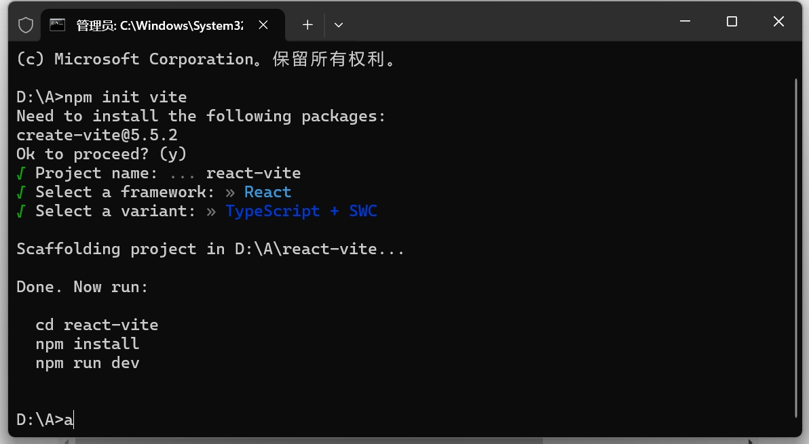
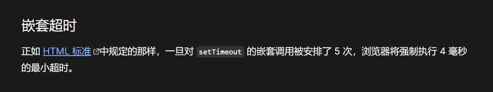

## 开发环境搭建

本次我们采用 vite 构建 react 项目

```sh
npm init vite
```



**目录介绍**

- public 公共目录
- src
  - assets 静态资源
  - App.css 根组件样式
  - App.tsx 根组件
  - index.css 全局 css 文件
  - main.tsx 全局 tsx 文件
  - vite-env.d.ts 声明文件
- .eslintrc.cjs eslint 配置文件
- .gitignore git 忽略文件
- index.html 入口文件 index.html
- package.json 项目依赖模块文件
- tsconfig.json ts 配置文件
- tsconfig.node.json vite-ts 配置文件
- vite.config.ts vite 配置文件

**FAQ：**

- public 公共目录和 src 下的 assets 静态资源有什么区别？

  答：public 目录中的资源编译之后会存放到根目录，不会被编译；而静态资源 assets 是会随着项目一起打包。

- 为什么 main.tsx 的`document.getElementById('root')!`需要加`!`?

  答：因为`document.getElementById('root')`返回值可能为空，`!`是非空断言。

**package.json**

在`package.json`文件中的`scripts`是一些执行命令，他会先在 node_modules 的`.bin`中去找，没有就会去全局去找，再没有就会去环境变量中寻找，再没有就会报错。

```json
"dev": "vite",//启动开发模式项目
"build": "tsc && vite build", //打包构建生产包
"lint": "eslint . --ext ts,tsx --report-unused-disable-directives --max-warnings 0",//代码检查
"preview": "vite preview" //预览模式
```

## tsx 语法

什么是 jsx 语法，全称：javascript and XML，允许在 js 中编写 html 代码。tsx 就是在 jsx 的基础上添加了类型。

- 绑定变量

  ```tsx
  function App() {
    const num: number = 12;
    const fn = () => {
      return <div></div>;
    };
    const style = { width: "100px" };
    return (
      <>
        <div>{"张三" /**字符串用法 */}</div>
        <div>{num /**变量用法 */}</div>
        <div>{fn() /**函数用法 */}</div>
        <div>{new Date().getTime() /**API用法 */}</div>
        {/* 绑定class，这里必须写成className */}
        <div className="red"></div>
        {/* 绑定style */}
        <div style={{ width: "100px" }}></div>
        <div style={style}></div>
      </>
    );
  }
  ```

  - 事件绑定：使用小驼峰

  ```tsx
  function App() {
    const fn = () => {
      console.log(123);
    };
    const fnEvent = (num, e) => {
      console.log(num, e);
    };
    //正常写泛型语法会跟tsx语法冲突，他会把泛型理解成是一个元素，如<div>，解决方案后面加一个","
    const fnT = <T,>(name: T) => {
      console.log(name);
    };
    return (
      <>
        <div onClick={fn}>点击</div>
        <div onClick={(e) => fnEvent(213, e)}>点击</div>
        <div onClick={() => fnT("张三")}>点击</div>
      </>
    );
  }
  ```

  - 渲染 html 代码片段(dangerouslySetInnerHTML)

  ```tsx
  function App() {
    const html = "<div>123</div>";
    return (
      <>
        <div dangerouslySetInnerHTML={{ __html: html }}></div>
      </>
    );
  }
  ```

  - 遍历 dom 元素，使用`map`

  ```tsx
  function App() {
    const arr = ["a", "b", "c", "d", "e"];
    return (
      <>
        {arr.map((item) => (
          <div>{item}</div>
        ))}
      </>
    );
  }
  ```

  - 条件语句，使用三元表达式

  ```tsx
  function App() {
    let flag: boolean = false;
    return <>{flag ? "是" : "否"}</>;
  }
  ```

## 工具

### Babel

**什么是 Babel?**

[Babel 官网](https://babeljs.io/)

[查看 AST 抽象语法树](https://astexplorer.net/)

Babel 是一个 JavaScript 编译器,提供了 JavaScript 的编译过程，能够将源代码转换为目标代码。

AST -> Transform -> Generate

**核心功能**

- 语法转换：将新版本的 JavaScript 语法转换为旧版本的语法
- Polyfill：通过引入额外的代码，使新功能在旧浏览器中可用
- JSX: 将 JSX 语法转换成普通的 JavaScript 语法
- 插件: 为 Babel 提供自定义功能

**案例**

**1. 语法转换：将新版本的 JavaScript 语法转换为旧版本的语法**

```sh
npm install --save-dev @babel/core @babel/cli @babel/preset-env
```

测试用例 1

```js
//test.js
const a = (query = 2) => 2 + query;
const b = [1, 2];
const c = [...b, 3, 4];
class Babel {}
new Babel();
```

转换代码

```js
import babel from "@babel/core";
import presetEnv from "@babel/preset-env"; //es6 => es5核心包
import fs from "node:fs";
const fscode = fs.readFileSync("./test.js", "utf8");
const { code } = babel.transform(fscode, {
  presets: [presetEnv],
});
```

转换之后的代码

```js
"use strict";
function _typeof(o) {
  "@babel/helpers - typeof";
  return (
    (_typeof =
      "function" == typeof Symbol && "symbol" == typeof Symbol.iterator
        ? function (o) {
            return typeof o;
          }
        : function (o) {
            return o &&
              "function" == typeof Symbol &&
              o.constructor === Symbol &&
              o !== Symbol.prototype
              ? "symbol"
              : typeof o;
          }),
    _typeof(o)
  );
}
function _defineProperties(e, r) {
  for (var t = 0; t < r.length; t++) {
    var o = r[t];
    (o.enumerable = o.enumerable || !1),
      (o.configurable = !0),
      "value" in o && (o.writable = !0),
      Object.defineProperty(e, _toPropertyKey(o.key), o);
  }
}
function _createClass(e, r, t) {
  return (
    r && _defineProperties(e.prototype, r),
    t && _defineProperties(e, t),
    Object.defineProperty(e, "prototype", { writable: !1 }),
    e
  );
}
function _toPropertyKey(t) {
  var i = _toPrimitive(t, "string");
  return "symbol" == _typeof(i) ? i : i + "";
}
function _toPrimitive(t, r) {
  if ("object" != _typeof(t) || !t) return t;
  var e = t[Symbol.toPrimitive];
  if (void 0 !== e) {
    var i = e.call(t, r || "default");
    if ("object" != _typeof(i)) return i;
    throw new TypeError("@@toPrimitive must return a primitive value.");
  }
  return ("string" === r ? String : Number)(t);
}
function _classCallCheck(a, n) {
  if (!(a instanceof n))
    throw new TypeError("Cannot call a class as a function");
}
var a = function a() {
  var query =
    arguments.length > 0 && arguments[0] !== undefined ? arguments[0] : 2;
  return 2 + query;
};
var b = [1, 2];
var c = [].concat(b, [3, 4]);
var Babel = /*#__PURE__*/ _createClass(function Babel() {
  _classCallCheck(this, Babel);
});
new Babel();
```

测试用例 2

```js
//test.js
const x = [1, 2, 3, 4, 5, 6, 7, 8, 9, 10].filter((x) => x % 2 === 0);
const y = Object.assign({}, { name: 1 });
```

转换代码

```js
import babel from "@babel/core";
import presetEnv from "@babel/preset-env"; //es6 => es5核心包
import fs from "node:fs";
const fscode = fs.readFileSync("./test.js", "utf8");
const { code } = babel.transform(fscode, {
  //useBuiltIns 有两个参数 entry 和 usage
  //entry 手动引入
  //usage 会根据配置的浏览器兼容，以及你代码中用到的 API 来进行 polyfill，实现了按需添加
  //corejs 3 是corejs的版本
  presets: [[presetEnv, { useBuiltIns: "usage", corejs: 3 }]],
});
```

转换之后的代码

```js
"use strict";
require("core-js/modules/es.array.filter.js");
require("core-js/modules/es.object.assign.js");
require("core-js/modules/es.object.to-string.js");
var x = [1, 2, 3, 4, 5, 6, 7, 8, 9, 10].filter(function (x) {
  return x % 2 === 0;
});
var y = Object.assign(
  {},
  {
    name: 1,
  }
);
```

**2. 代码转换 react jsx**

测试用例

```jsx
//test.jsx
import { createRoot } from "react-dom/client";
const App = () => {
  return <div>我是谁？？？？？</div>;
};
createRoot(document.getElementById("root")).render(<App />);
```

要支持转换需要添加一个预设

```sh
npm install @babel/preset-react -D
```

转换代码

```js
import babel from "@babel/core";
import presetEnv from "@babel/preset-env"; //es6 => es5核心包
import fs from "node:fs"; //支持jsx
import react from "@babel/preset-react";
const fscode = fs.readFileSync("./test.jsx", "utf8");
const { code } = babel.transform(fscode, {
  presets: [[presetEnv, { useBuiltIns: "usage", corejs: 3 }], react],
});
```

转换之后的代码

```js
"use strict";

var _client = require("react-dom/client");
var App = function App() {
  return /*#__PURE__*/ React.createElement(
    "div",
    null,
    "\u6211\u662F\u8C01\uFF1F\uFF1F\uFF1F\uFF1F\uFF1F"
  );
};
(0, _client.createRoot)(document.getElementById("root")).render(
  /*#__PURE__*/ React.createElement(App, null)
);
```

**3. 编写 Babel 插件**

测试用例

```js
//test.js
const a = (params = 2) => params + 2;
```

箭头函数转普通函数插件

```js
import babel from "@babel/core";
import fs from "node:fs";
const fscode = fs.readFileSync("./test.js", "utf8");
//types 包含了各种ast方法
const transformFunction = ({ types: t }) => {
  return {
    name: "transformFunction",
    visitor: {
      //匹配箭头函数
      ArrowFunctionExpression(path) {
        const { node } = path;
        //实现箭头函数转普通函数
        //async params body
        const arrowFunction = t.functionExpression(
          null, //null表示匿名函数
          node.params,
          t.blockStatement([t.returnStatement(node.body)]), //body需要转换
          node.async
        );
        path.replaceWith(arrowFunction);
      },
    },
  };
};
const { code } = babel.transform(fscode, {
  plugins: [transformFunction],
});
```

转换之后的代码

```js
const a = function (params = 2) {
  return params + 2;
};
```

### SWC

**什么是 SWC** 【[SWC 官网](https://swc.rs/)】

SWC 既可用于编译，也可用于打包。对于编译，它使用现代 JavaScript 功能获取 JavaScript / TypeScript 文件并输出所有主流浏览器支持的有效代码。

SWC 在单线程上比 Babel 快 20 倍，在四核上快 70 倍。

简单点来说 swc 实现了和 babel 一样的功能，但是它比 babel 快。

**核心功能**

- JavaScript/TypeScript 转换 可以将现代 JavaScript（ES6+）和 TypeScript 代码转换为兼容旧版 JavaScript 环境的代码。这包括语法转换（如箭头函数、解构赋值等）以及一些 polyfill 的处理
- 模块打包 SWC 提供了基础的打包功能，可以将多个模块捆绑成一个单独的文件
- SWC 支持代码压缩和优化功能，类似于 Terser。它可以对 JavaScript 代码进行压缩，去除不必要的空白、注释，并对代码进行优化以减小文件大小，提高加载速度
- SWC 原生支持 TypeScript，可以将 TypeScript 编译为 JavaScript
- SWC 支持 React 和 JSX 语法，可以将 JSX 转换为标准的 JavaScript 代码。它还支持一些现代的 React 特性

**案例**

```sh
npm install @wsc/core -D
```

**1. 将新版本的 JavaScript 语法转换为旧版本的语法**

测试用例

```js
const a = (query = 2) => 2 + query;
const b = [1, 2];
const c = [...b, 3, 4];
class Babel {}
new Babel();
const x = [1, 2, 3, 4, 5, 6, 7, 8, 9, 10].filter((x) => x % 2 === 0);
const y = Object.assign({}, { name: 1 });
```

转换代码

```js
import swc from "@swc/core";
const result = swc.transformFileSync("./test.js", {
  jsc: {
    target: "es5",
    parser: {
      syntax: "ecmascript",
    },
  },
});
```

转换后代码

```js
function _array_like_to_array(arr, len) {
  if (len == null || len > arr.length) len = arr.length;
  for (var i = 0, arr2 = new Array(len); i < len; i++) arr2[i] = arr[i];
  return arr2;
}
function _array_without_holes(arr) {
  if (Array.isArray(arr)) return _array_like_to_array(arr);
}
function _class_call_check(instance, Constructor) {
  if (!(instance instanceof Constructor)) {
    throw new TypeError("Cannot call a class as a function");
  }
}
function _iterable_to_array(iter) {
  if (
    (typeof Symbol !== "undefined" && iter[Symbol.iterator] != null) ||
    iter["@@iterator"] != null
  )
    return Array.from(iter);
}
function _non_iterable_spread() {
  throw new TypeError(
    "Invalid attempt to spread non-iterable instance.\\nIn order to be iterable, non-array objects must have a [Symbol.iterator]() method."
  );
}
function _to_consumable_array(arr) {
  return (
    _array_without_holes(arr) ||
    _iterable_to_array(arr) ||
    _unsupported_iterable_to_array(arr) ||
    _non_iterable_spread()
  );
}
function _unsupported_iterable_to_array(o, minLen) {
  if (!o) return;
  if (typeof o === "string") return _array_like_to_array(o, minLen);
  var n = Object.prototype.toString.call(o).slice(8, -1);
  if (n === "Object" && o.constructor) n = o.constructor.name;
  if (n === "Map" || n === "Set") return Array.from(n);
  if (n === "Arguments" || /^(?:Ui|I)nt(?:8|16|32)(?:Clamped)?Array$/.test(n))
    return _array_like_to_array(o, minLen);
}
var a = function () {
  var query =
    arguments.length > 0 && arguments[0] !== void 0 ? arguments[0] : 2;
  return 2 + query;
};
var b = [1, 2];
var c = _to_consumable_array(b).concat([3, 4]);
var Babel = function Babel() {
  "use strict";
  _class_call_check(this, Babel);
};
new Babel();
var x = [1, 2, 3, 4, 5, 6, 7, 8, 9, 10].filter(function (x) {
  return x % 2 === 0;
});
var y = Object.assign(
  {},
  {
    name: 1,
  }
);
```

**2. 代码转换 react jsx**

测试用例

```js
import { createRoot } from "react-dom/client";
const App = () => {
  return <div>我是谁？？？？？</div>;
};
createRoot(document.getElementById("root")).render(<App />);
```

转换代码

```js
import swc from "@swc/core";
const result = swc.transformFileSync("./app.jsx", {
  jsc: {
    target: "es5",
    parser: {
      syntax: "ecmascript",
      jsx: true,
    },
  },
});
```

转换后代码

```js
import { createRoot } from "react-dom/client";
var App = function () {
  return /*#__PURE__*/ React.createElement("div", null, "我是谁？？？？？");
};
createRoot(document.getElementById("root")).render(
  /*#__PURE__*/ React.createElement(App, null)
);
```

## 原理

[React 源码解析](https://pomb.us/build-your-own-react/)

### 虚拟 DOM(Virtual DOM)

Virtual DOM 就是用 JavaScript 对象去描述一个 DOM 结构，虚拟 DOM 不是直接操作浏览器的真实 DOM，而是首先对 UI 的更新在虚拟 DOM 中进行，再将变更高效地同步到真实 DOM 中。

优点

- 性能优化：直接操作真实 DOM 是比较昂贵的，尤其是当涉及到大量节点更新时。虚拟 DOM 通过减少不必要的 DOM 操作，主要提现在 diff 算法的复用操作，其实也提升不了多少性能。
- 跨平台性：虚拟 DOM 是一个与平台无关的概念，它可以映射到不同的渲染目标，比如浏览器的 DOM 或者移动端(`React Native`)的原生 UI。

**实现简易虚拟 DOM**

- React.createElement：用于生成虚拟 DOM 树，返回一个包含 type（元素类型）和 props（属性和子元素）的对象。 children 可以是文本或其他虚拟 DOM 对象。
- React.createTextElement：用于处理文本节点，将字符串封装成虚拟 DOM 对象。
- 将虚拟 DOM 转化为实际 DOM 元素。 使用递归的方式渲染所有子元素。 最后将生成的 DOM 节点插入到指定的容器中

```js
const React = {
  createElement(type, props, ...children) {
    return {
      type,
      props: {
        ...props,
        children: children.map((child) =>
          typeof child === "object" ? child : React.createTextElement(child)
        ),
      },
    };
  },
  createTextElement(text) {
    return {
      type: "TEXT_ELEMENT",
      props: {
        nodeValue: text,
        children: [],
      },
    };
  },
};
```

### React Fiber

Fiber 是 React 16 引入的一种新的协调引擎，用于解决和优化 React 应对复杂 UI 渲染时的性能问题

示例：[未使用 fiber 版本](https://claudiopro.github.io/react-fiber-vs-stack-demo/stack.html) 与 [使用 fiber 版本](https://claudiopro.github.io/react-fiber-vs-stack-demo/fiber.html) 的区别

**Fiber 的作用**

为了解决 React15 在大组件更新时产生的卡顿现象，React 团队提出了 Fiber 架构，并在 React16 发布，将 同步递归无法中断的更新 重构为 异步的可中断更新

实现了 4 个具体目标

- 可中断的渲染：Fiber 允许将大的渲染任务拆分成多个小的工作单元（Unit of Work），使得 React 可以在空闲时间执行这些小任务。当浏览器需要处理更高优先级的任务时（如用户输入、动画），可以暂停渲染，先处理这些任务，然后再恢复未完成的渲染工作。
- 优先级调度：在 Fiber 架构下，React 可以根据不同任务的优先级决定何时更新哪些部分。React 会优先更新用户可感知的部分（如动画、用户输入），而低优先级的任务（如数据加载后的界面更新）可以延后执行。
- 双缓存树（Fiber Tree）：Fiber 架构中有两棵 Fiber 树——current fiber tree（当前正在渲染的 Fiber 树）和 work in progress fiber tree（正在处理的 Fiber 树）。React 使用这两棵树来保存更新前后的状态，从而更高效地进行比较和更新。
- 任务切片：在浏览器的空闲时间内（利用 requestIdleCallback 思想），React 可以将渲染任务拆分成多个小片段，逐步完成 Fiber 树的构建，避免一次性完成所有渲染任务导致的阻塞。

**双缓存**

react 内部有两颗树维护着两个状态：`fiber tree` 与 `work in progress fiber tree`

- `fiber tree`：表示当前正在渲染的 fiber 树
- `work in progress fiber tree`：表示更新过程中新生成的 fiber 树，也就是渲染的下一次 UI 状态

当我们用 canvas 绘制动画时，每一帧绘制前都会调用 ctx.clearRect 清除上一帧的画面，如果当前帧画面计算量比较大，导致清除上一帧画面到绘制当前帧画面之间有较长间隙，就会出现白屏。

为了解决这个问题，我们可以在内存中绘制当前帧动画，绘制完毕后直接用当前帧替换上一帧画面，由于省去了两帧替换间的计算时间，不会出现从白屏到出现画面的闪烁情况。

**任务切片**

我们在理解任务切片之前，需要理解浏览器一帧做些什么

- 处理事件的回调 click...事件
- 处理计时器的回调
- 开始帧
- 执行 `requestAnimationFrame` 动画的回调
- 计算机页面布局计算 合并到主线程
- 绘制
- 如果此时还有空闲时间，执行 `requestIdleCallback`

假如要更新 10000 条数据，我们可以分成三个任务进行更新，并把每一段任务插入`requestIdleCallback`

### diff 算法

Diff 算法主要用于比较新旧虚拟 DOM 树，找出需要更新的部分，减少实际 DOM 操作的次数，从而提升性能。

**步骤：**

- 根节点比较：首先比较两个树的根节点。
- 节点类型检查：
  - 相同类型：进行属性对比、子节点对比。
  - 不同类型：替换节点。
- 子节点比较：通过递归对比每个子节点：
  - 如果子节点相同，继续比较其子节点。
  - 使用 key 来识别节点的新增、删除或重排序。
- 批量更新：React 在完成 Diff 比较后，会将所有需要更新的内容一次性应用到实际 DOM 中，减少重排和重绘。

**代码实现 vDom Fiber Diff**

```js
const React = {
  createElement(type, props, ...children) {
    return {
      type,
      props: {
        ...props,
        children: children.map((child) =>
          typeof child === "object" ? child : React.createTextElement(child)
        ),
      },
    };
  },
  createTextElement(text) {
    return {
      type: "TEXT_ELEMENT",
      props: {
        nodeValue: text,
        children: [],
      },
    };
  },
};

let wipRoot = null; //当前正在工作的fiber树
let currentRoot = null; //当前fiber树的根
let deletions = null; //存储需要删除的fiber
let nextUnitOfWork = null; //下一个工作单元

const render = (element, container) => {
  wipRoot = {
    dom: container, //渲染目标的 DOM 容器
    props: {
      children: [element], //要渲染的元素（如 React 元素）
    },
    //alternate 是 React Fiber 树中的一个关键概念，用于双缓冲机制（双缓冲 Fiber Tree）。currentRoot 是之前已经渲染过的 Fiber 树的根，wipRoot 是新一轮更新的根 Fiber 节点。
    //它们通过 alternate 属性相互关联
    alternate: currentRoot, //旧的fiber树
  };
  ////nextUnitOfWork 是下一个要执行的工作单元（即 Fiber 节点）。在这里，将其设置为 wipRoot，表示渲染工作从根节点开始
  nextUnitOfWork = wipRoot;
  //专门用于存放在更新过程中需要删除的节点。在 Fiber 更新机制中，如果某些节点不再需要，就会将它们放入 deletions，
  //最后在 commitRoot 阶段将它们从 DOM 中删除
  deletions = [];
};

//创建 fiber 节点
const createFiber = (element, parent) => {
  return {
    type: element.type,
    props: element.props,
    parent,
    dom: null,
    child: null,
    sibling: null,
    alternate: null,
    effectTag: null,
  };
};

//创建dom节点
const createDom = (fiber) => {
  const dom =
    fiber.type === "TEXT_ELEMENT"
      ? document.createTextNode("")
      : document.createElement(fiber.type);
  updateDom(dom, {}, fiber.props);
  return dom;
};
//更新dom节点属性
const updateDom = (dom, prevProps, nextProps) => {
  //删除旧属性
  Object.keys(prevProps)
    .filter((name) => name !== "children")
    .forEach((key) => {
      dom[key] = "";
    });
  //添加新属性
  Object.keys(nextProps)
    .filter((name) => name !== "children")
    .filter((name) => prevProps[name] !== nextProps[name])
    .forEach((key) => {
      dom[key] = nextProps[key];
    });
};

//Fiber 调度器 实现将耗时任务拆分成多个小的工作单元
//deadline 表示浏览器空闲时间
function workLoop(deadline) {
  //用来指示是否需要让出控制权给浏览器。如果时间快用完了，则设为 true，以便及时暂停任务，避免阻塞主线程
  let shouldYield = false;
  while (nextUnitOfWork && !shouldYield) {
    //performUnitOfWork 是一个函数，它处理当前的工作单元，并返回下一个要执行的工作单元。每次循环会更新 nextUnitOfWork 为下一个工作单元
    nextUnitOfWork = performUnitOfWork(nextUnitOfWork);
    //使用 deadline.timeRemaining() 来检查剩余的空闲时间。如果时间少于 1 毫秒，就设置 shouldYield 为 true，表示没有空闲时间了，就让出控制权
    shouldYield = deadline.timeRemaining() < 1;
  }
  //表示所有的任务执行完成 并且还有待提交的工作根
  if (!nextUnitOfWork && wipRoot) {
    commitRoot();
  }
  //使用 requestIdleCallback 来安排下一个空闲时间段继续执行 workLoop，让任务在浏览器空闲时继续进行
  requestIdleCallback(workLoop);
}
requestIdleCallback(workLoop);

// 执行一个工作单元
function performUnitOfWork(fiber) {
  // 如果没有 DOM 节点，为当前 Fiber 创建 DOM 节点
  if (!fiber.dom) {
    fiber.dom = createDom(fiber);
  }
  //确保每个 Fiber 节点都在内存中有一个对应的 DOM 节点准备好，以便后续在提交阶段更新到实际的 DOM 树中
  // 创建子节点的 Fiber
  // 子节点在children中
  const elements = fiber.props.children;
  //遍历子节点
  reconcileChildren(fiber, elements);
  // 返回下一个工作单元（child, sibling, or parent）
  if (fiber.child) {
    return fiber.child;
  }
  let nextFiber = fiber;
  while (nextFiber) {
    if (nextFiber.sibling) {
      return nextFiber.sibling;
    }
    nextFiber = nextFiber.parent;
  }
  return null;
}
// diff 算法: 将子节点与之前的 Fiber 树进行比较
const reconcileChildren = (fiber, elements) => {
  let index = 0;
  let prevSibling = null;
  let oldFiber = fiber.alternate && fiber.alternate.child; //旧的fiber树
  while (index < elements.length || oldFiber != null) {
    const element = elements[index];
    let newFiber = null;

    // 比较旧 Fiber 和新元素
    const sameType = oldFiber && element && element.type === oldFiber.type;
    //如果是同类型的节点，复用
    if (sameType) {
      newFiber = {
        type: oldFiber.type,
        props: element.props,
        parent: fiber,
        dom: oldFiber.dom,
        alternate: oldFiber,
        effectTag: "UPDATE",
      };
    }
    //如果新节点存在，但类型不同，新增fiber节点
    if (element && !sameType) {
      newFiber = createFiber(element, fiber);
      newFiber.effectTag = "PLACEMENT";
    }
    //如果旧节点存在，但新节点不存在，删除旧节点
    if (oldFiber && !sameType) {
      oldFiber.effectTag = "DELETION";
      deletions.push(oldFiber);
    }
    //移动旧fiber指针到下一个兄弟节点
    if (oldFiber) oldFiber = oldFiber.sibling;
    // 将新fiber节点插入到DOM树中
    if (index == 0) {
      //将第一个子节点设置为父节点的子节点
      fiber.child = newFiber;
    } else if (element) {
      //将后续子节点作为前一个兄弟节点的兄弟
      prevSibling.sibling = newFiber;
    }
    //更新兄弟节点
    prevSibling = newFiber;
    index++;
  }
};
const commitRoot = () => {
  deletions.forEach(commitWork); // 删除需要删除的 Fiber 节点
  commitWork(wipRoot.child);
  currentRoot = wipRoot; //存旧的fiber
  wipRoot = null;
};

// 提交单个 Fiber 节点
const commitWork = (fiber) => {
  if (!fiber) return;
  const domParent = fiber.parent.dom;
  if (fiber.effectTag == "PLACEMENT") {
    domParent.appendChild(fiber.dom);
  } else if (fiber.effectTag == "UPDATE") {
    updateDom(fiber.dom, fiber.alternate.props, fiber.props);
  } else if (fiber.effectTag == "DELETION") {
    domParent.removeChild(fiber.dom);
  }
  commitWork(fiber.child);
  commitWork(fiber.sibling);
};
// 测试用例diff
render(
  React.createElement(
    "div",
    { id: 1 },
    React.createElement("span", null, "1111")
  ),
  document.getElementById("root")
);

setTimeout(() => {
  render(
    React.createElement(
      "div",
      { id: 1 },
      React.createElement("span", null, "2222")
    ),
    document.getElementById("root")
  );
}, 2000);
```

### requestidlecallback

它提供了一种机制，允许开发者在浏览器空闲时运行低优先级的任务，而不会影响关键任务和动画的性能。

**requestidlecallback 执行阶段**

- 处理事件的回调 click...事件
- 处理计时器的回调
- 开始帧
- 执行 requestAnimationFrame 动画的回调
- 计算机页面布局计算 合并到主线程
- 绘制
- 如果此时还有空闲时间，执行 requestIdleCallback

**基本用法**

`requestidlecallback` 接受两个参数，第一个是一个 `callback` 并且在回调函数中会注入参数 `deadline`，第二个是`options`

`deadline`有两个值：

- `deadline.timeRemaining()` ：是否还有空闲时间(毫秒)
- `deadline.didTimeout` ：是否因为超时被强制执行(布尔值)

`options`：

- `timeout:2000`：回调的最大等待时间（毫秒），如果在指定的 timeout 时间内没有空闲时间，回调会强制执行，避免任务无限期推迟。

**案例**

模拟 2000 条数据

```js
const total = 2000;
const arr = [];
function genrateArr() {
  for (let i = 0; i < total; i++) {
    arr.push(function () {
      document.body.innerHTML += `<div>${i + 1}</div>`;
    });
  }
}
genrateArr();
function workloop(item) {
  // 检查当前空闲时间是否大于1毫秒，并且任务数组中还有任务未执行
  if (item.timeRemaining() > 1 && arr.length > 0) {
    const fn = arr.shift();
    fn();
  }
  // 再次使用 requestIdleCallback 调度下一个空闲时间执行任务
  requestIdleCallback(workloop);
}
// 开始调度任务，在浏览器空闲时执行 workLoop
requestIdleCallback(workloop);
```

**面试相关问题**

- 兼容性差 Safari 并不支持 [Can I use](https://caniuse.com/?search=requestIdleCallback)
- 控制精细度 React 要根据组件优先级、更新的紧急程度等信息，更精确地安排渲染的工作
- 执行时机 requestIdleCallback(callback) 回调函数的执行间隔是 50ms（W3C 规定），也就是 20FPS，1 秒内执行 20 次，间隔较长。
- 差异性 每个浏览器实现该 API 的方式不同，导致执行时机有差异有的快有的慢

**requestIdleCallback 替代方案**

`MessageChannel`：选择 `MessageChannel` 的原因，是首先异步得是个宏任务，因为宏任务中会在下次事件循环中执行，不会阻塞当前页面的更新。`MessageChannel` 是一个宏任务。没选常见的 `setTimeout`，是因为 `MessageChannel` 能较快执行，在 0 ～ 1ms 内触发，像 setTimeout 即便设置 timeout 为 0 还是需要 4 ～ 5ms。若浏览器不支持 `MessageChannel`，还是得降级为 `setTimeout`。



**MessageChannel 基本用法**

`MessageChanne` 设计初衷是为了方便我们在不同的上下文之间进行通讯，如 web Worker,iframe 它提供了两个端口（port1 和 port2），通过这些端口，消息可以在两个独立的线程之间双向传递

```js
const channel = new MessageChannel();
//设置 port1 的消息处理函数
channel.port1.onmessage = (event) => {
  console.log(event.data);
};
// 通过 port2 发送消息给 port1
channel.port2.postMessage("我是port2");
```

**实现简易版 react 调度器**

React 调度器给每一个任务分配了优先级

- ImmediatePriority : 立即执行的优先级，级别最高
- UserBlockingPriority : 用户阻塞级别的优先级
- NormalPriority : 正常的优先级
- LowPriority : 低优先级
- IdlePriority : 最低阶的优先级

> 同时还给每个任务设置了过期时间，过期时间越短，优先级越高
> 声明 taskQueue 为数组，存储每个任务的信息，包括优先级，过期时间，回调函数，
> 声明 isPerformingWork 为布尔值，表示当前是否在执行任务，
> 声明 port 为 MessageChannel，用于发送和接收消息，
> 然后将任务添加到队列里面，并且添加进去的时候还需要根据优先级进行排序，然后调用 workLoop 执行任务

```js
const ImmediatePriority = 1; // 立即执行的优先级, 级别最高 [点击事件，输入框，]
const UserBlockingPriority = 2; // 用户阻塞级别的优先级, [滚动，拖拽这些]
const NormalPriority = 3; // 正常的优先级 [redner 列表 动画 网络请求]
const LowPriority = 4; // 低优先级  [分析统计]
const IdlePriority = 5; // 最低阶的优先级, 可以被闲置的那种 [console.log]

function getCurrentTime() {
  return performance.now();
}

class SimpleScheduler {
  constructor() {
    this.taskQueue = [];
    this.isPerformingWork = false; //是否在工作 防止重复调用
    const channel = new MessageChannel();
    this.port = channel.port2; //发送消息
    channel.port1.onmessage = this.performWorkUntilDeadline.bind(this);
  }
  /**
   * 调度任务
   * @param {优先级} priorityLevel
   * @param {回调函数} callback
   */
  scheduleCallback(priorityLevel, callback) {
    const curTime = getCurrentTime();
    let timeout;
    // 根据优先级设置超时时间，超时时间越小，优先级越高
    switch (priorityLevel) {
      case ImmediatePriority:
        timeout = -1;
        break;
      case UserBlockingPriority:
        timeout = 250;
        break;
      case LowPriority:
        timeout = 10000;
        break;
      case IdlePriority:
        timeout = 1073741823; //32位操作系统v8引擎所对应的最大时间
        break;
      case NormalPriority:
      default:
        timeout = 5000;
        break;
    }
    const task = {
      callback,
      priorityLevel,
      expirationTime: curTime + timeout, // 直接根据当前时间加上超时时间
    };
    this.push(this.taskQueue, task);
    this.schedulePerformWorkUntilDeadline();
  }
  // 通过 MessageChannel 调度执行任务
  schedulePerformWorkUntilDeadline() {
    //没有工作再执行
    if (!this.isPerformingWork) {
      this.isPerformingWork = true;
      this.port.postMessage(null);
    }
  }
  // 执行任务
  performWorkUntilDeadline() {
    this.isPerformingWork = true;
    this.workloop();
    this.isPerformingWork = false;
  }
  workloop() {
    let currentTask = this.peek(this.taskQueue);
    while (currentTask) {
      let cb = currentTask.callback;
      cb && cb();
      this.pop(this.taskQueue);
      currentTask = this.peek(this.taskQueue);
    }
  }
  push(queue, task) {
    queue.push(task);
    queue.sort((a, b) => a.expirationTime - b.expirationTime);
  }
  peek(queue) {
    return queue[0] || null;
  }
  pop(queue) {
    return queue.shift();
  }
}

const s = new SimpleScheduler();
s.scheduleCallback(UserBlockingPriority, () => {
  console.log(2);
});
s.scheduleCallback(NormalPriority, () => {
  console.log(3);
});
s.scheduleCallback(ImmediatePriority, () => {
  console.log(1);
});
```

## 组件

### 全局组件

Message/index.tsx

```tsx
import { Root, createRoot } from "react-dom/client";
import "./index.css";
export default function Message() {
  return <div>提示消息</div>;
}
interface Itesm {
  ele: HTMLDivElement;
  root: Root;
}
const queue: Itesm[] = [];
window.onShow = () => {
  const ele = document.createElement("div");
  ele.className = "message";
  ele.style.top = `${queue.length * 50}px`;
  document.body.appendChild(ele);
  const root = createRoot(ele);
  root.render(<Message />);
  queue.push({ ele, root });
  setTimeout(() => {
    const item = queue.find((item) => item.ele === ele)!;
    document.body.removeChild(item.ele);
    item.root.unmount();
    queue.splice(queue.indexOf(item), 1);
  }, 2000);
};
//声明扩充
declare global {
  interface Window {
    onShow: () => void;
  }
}
```

Message/index.css

```css
.message {
  width: 160px;
  height: 30px;
  position: fixed;
  top: 10px;
  left: 50%;
  margin-left: -80px;
  background: #fff;
  border: 1px solid #ccc;
  text-align: center;
  line-height: 30px;
  border-radius: 5px;
}
```

在 main.tsx 引入全局组件

```tsx
import "./components/Message/index.tsx";
```

在 APP.tsx 中使用

```tsx
function App() {
  return (
    <>
      <button onClick={() => window.onShow()}>提示消息</button>
    </>
  );
}

export default App;
```

### 组件通信

> React 组件使用 props 来互相通信。每个父组件都可以提供 props 给它的子组件，从而将一些信息传递给它。Props 可能会让你想起 HTML 属性，但你可以通过它们传递任何 JavaScript 值，包括对象、数组和函数 以及 html 元素，这样可以使我们的组件更加灵活。

1. 父向子组件传递 props

```tsx
string title={'测试'}
number id={1}
boolean isGirl={false}
null empty={null}
undefined empty={undefined}
object obj={ { a: 1, b: 2 } }
array arr={[1, 2, 3]}
function cb={(a: number, b: number) => a + b}
JSX.Element element={<div>测试</div>}
```

子组件接受父组件传递的 props，props 是一个对象，会作为函数的第一个参数接受传过来的 props 值，我们需要遵守单向数据流，子组件不能直接修改父组件的 props，在 React 源码中会使用 Object.freeze 冻结 props，限制 props 的修改。

`Object.freeze()`：静态方法可以使一个对象被冻结。冻结对象可以防止扩展，并使现有的属性不可写入和不可配置。被冻结的对象不能再被更改：不能添加新的属性，不能移除现有的属性，不能更改它们的可枚举性、可配置性、可写性或值，对象的原型也不能被重新指定

`React.FC`：是函数式组件，是在 TS 使用的一个范型。FC 是 Function Component 的缩写，能帮助我们自动推导 Props 的类型。

```tsx
import React from "react";
interface Props {
  title: string;
  id: number;
  obj: {
    a: number;
    b: number;
  };
  arr: number[];
  cb: (a: number, b: number) => number;
  empty: null;
  element: JSX.Element;
}
//第一种方式
const Test: React.FC<Props> = (props) => {
  console.log(props);
  return <div>Test</div>;
};
//第二种方式
const Test = (props: Props) => {
  console.log(props);
  return <div>Test</div>;
};

export default Test;
```

2. 定义默认值

将 props 进行解构，定义默认值

```tsx
import React from "react";
interface Props {
  title?: string;
  id: number;
  obj: {
    a: number;
    b: number;
  };
  arr: number[];
  cb: (a: number, b: number) => number;
  empty: null;
  element: JSX.Element;
}

const Test: React.FC<Props> = ({ title = "默认标题" }) => {
  return <div>Test</div>;
};

export default Test;
```

使用 defaultProps 进行默认值赋值，最后把 defaultProps 和 props 合并

```tsx
import React from "react";
interface Props {
  title?: string;
  id: number;
  obj: {
    a: number;
    b: number;
  };
  arr: number[];
  cb: (a: number, b: number) => number;
  empty: null;
  element: JSX.Element;
}

const defaultProps: Partial<Props> = {
  title: "默认标题",
};

const Test: React.FC<Props> = (props) => {
  const { title } = { ...defaultProps, ...props };
  return <div>{title}</div>;
};

export default Test;
```

3. props.children

类似于 Vue 的插槽，直接在子组件内部插入标签会自动一个参数 `props.children`

```tsx
function App() {
  return (
    <>
      <Test>
        <div>111</div>
      </Test>
    </>
  );
}
```

使用`children`属性，注：在之前的版本 children 是不需要手动定义的，在 18 之后改为需要手动定义类型

```tsx
import React from "react";
interface Props {
  children: React.ReactNode; //手动声明children
}

const Test: React.FC<Props> = (props) => {
  return <div>{props.children}</div>;
};

export default Test;
```

4. 子组件给父组件传值

父组件传递函数过去,其本质就是函数的回调

```tsx
import Test from "./components/Test";
function App() {
  const fn = (params: string) => {
    console.log("子组件触发了 父组件的事件", params);
  };
  return (
    <>
      <Test callback={fn}></Test>
    </>
  );
}
```

子组件接受函数，并且在对应的事件调用函数，回调参数回去

```tsx
import React from "react";
interface Props {
  callback: (params: string) => void;
  children?: React.ReactNode;
}

const Test: React.FC<Props> = (props) => {
  return (
    <div>
      <button onClick={() => props.callback("这是子组件")}>派发事件</button>
    </div>
  );
};

export default Test;
```

5. 兄弟组件通信

原理就是发布订阅设计模式，原生浏览器已经实现了这个模式我们可以直接使用。不想使用原生浏览器，可以使用 [mitt](https://www.npmjs.com/package/mitt)

```tsx
import Card from "./components/Card";
import Test from "./components/Test";
function App() {
  return (
    <>
      <Test></Test>
      <Card></Card>
    </>
  );
}

export default App;
```

```tsx
import React from "react";
const Test: React.FC = (props) => {
  const event = new Event("on-card"); //添加到事件中心
  const clickTap = () => {
    console.log(event);
    event.params = { name: "我是测试组件" };
    window.dispatchEvent(event); //派发事件
  };
  return (
    <div>
      <button onClick={clickTap}>派发事件</button>
    </div>
  );
};
//扩充event类型
declare global {
  interface Event {
    params: any;
  }
}

export default Test;
```

```tsx
import "./index.css";
export default function Test2() {
  //接受参数
  window.addEventListener("on-card", (e) => {
    console.log(e.params, "触发了");
  });

  return <div className="card"></div>;
}
```
