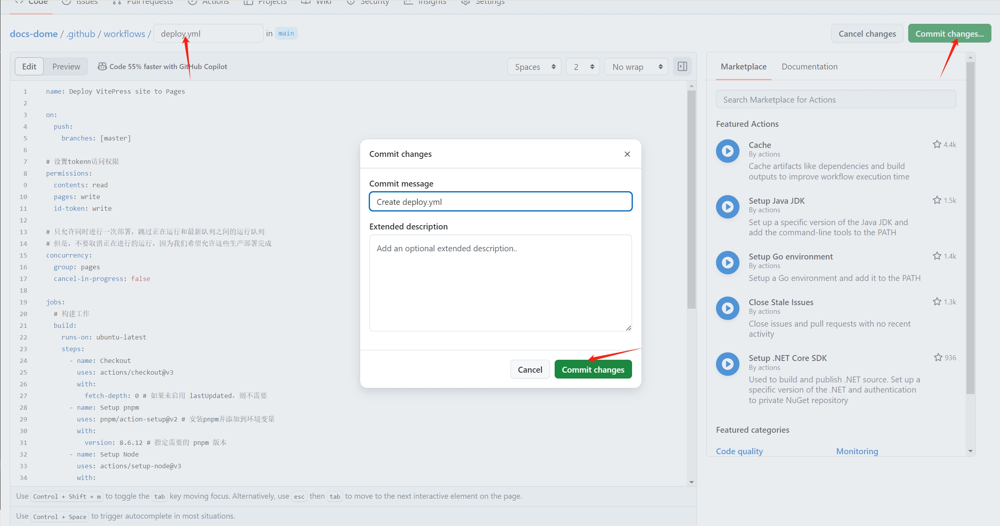

# vitepress 搭建并部署网站

## 前言

本片文章会带领大家使用 vitepress 搭建静态站点并部署到 github pages 上。

## 创建项目

接下来我会一步一步带着大家去搭建属于自己的文档，也可以自己去官网（[vitepress](https://vitepress.dev/zh/guide/what-is-vitepress)）研究。

**安装 vitepress**

首先创建一个文件夹，使用 cmd 打开这个文件夹。

```sh
pnpm add -D vitepress
```

**初始化 vitepress**

```sh
pnpm vitepress init
```

需要回答几个简单的问题：

- 第一个是在当前根目录下创建 vitepress 项目。
- 站点标题和描述。后续可以在配置中改。
- 主题，建议选择第二个，选其他也可以。
- 是否使用 ts，看自己需不需要，我这里选择的需要。
- 是否添加脚本到 package.json，启动命令，打包命令这些都得用。

```sh
o  Where should VitePress initialize the config?
|  ./
|
o  Site title:
|  My Awesome Project
|
o  Site description:
|  A VitePress Site
|
o  Theme:
|  Default Theme + Customization
|
o  Use TypeScript for config and theme files?
|  Yes
|
o  Add VitePress npm scripts to package.json?
|  Yes
|
—  Done! Now run pnpm run docs:dev and start writing.
```

初始化成功后，会看到这样一个目录。

- .vitepress，最核心的目录。
- theme 目录。自定义主题配置，css 样式等。
- config.mts。最核心的文件，各种配置导航栏、侧边栏、标题什么的都是在这里。
- node_modules。安装的依赖。
- api-examples.md 和 markdown-examples.md。官方给的两个示例。
- index.md。主页相关。
- package.json 和 pnpm-lock.yml。包管理工具需要用的。

  

**启动项目**

```sh
pnpm run docs:dev
```

如下界面


## github pages 部署

Github Pages 专门用来托管静态内容，由于不需要服务器且基于 git，支持 CI/CD，成为很多静态网站比如博客、文档网站的很好的选择。下面介绍流程

1. 在 github 上面创建一个仓库，没有 github 可以先注册一个。

   

   

2. 添加和更改必要文件。

   创建完成后需要把`config.mts`中的`base`改为你创建仓库的名称

   

   需要在文件根目录添加两个文件`.nojekyll`与`.gitignore`

   - `.nojekyll`是一个空文件，没有这个文件一些`css`会被忽略
   - `.gitignore`忽略不需要上传到 github 的文件，内容如下

     ```
     node_modules
     .DS_Store
     dist
     dist-ssr
     cache
     .cache
     .temp
     *.local
     ```

3. 上传到仓库

   ```sh
   # 初始git化仓库
   git init
   # 添加本地所有文件到git仓库
   git add .
   # 创建第一次提交
   git commit -m "init"
   # 添加远程仓库地址到本地
   git remote add origin https://github.com/liuyu0118/docs-dome.git
   # 推送项目到github
   git push -u origin master
   ```

4. 选择 github actions

   

5. 设置工作流

   

6. 设置`deploy`脚本

   脚本文件：我这里使用的是`pnpm`，使用 npm 或者其他的可以参考 [vitepress 官方文档](https://vitepress.dev/guide/deploy#github-pages)

```
name: Deploy VitePress site to Pages

on:
  push:
    branches: [master]

# 设置tokenn访问权限
permissions:
  contents: read
  pages: write
  id-token: write

# 只允许同时进行一次部署，跳过正在运行和最新队列之间的运行队列
# 但是，不要取消正在进行的运行，因为我们希望允许这些生产部署完成
concurrency:
  group: pages
  cancel-in-progress: false

jobs:
  # 构建工作
  build:
    runs-on: ubuntu-latest
    steps:
      - name: Checkout
        uses: actions/checkout@v3
        with:
          fetch-depth: 0 # 如果未启用 lastUpdated，则不需要
      - name: Setup pnpm
        uses: pnpm/action-setup@v2 # 安装pnpm并添加到环境变量
        with:
          version: 8.6.12 # 指定需要的 pnpm 版本
      - name: Setup Node
        uses: actions/setup-node@v3
        with:
          node-version: 18
          cache: pnpm # 设置缓存
      - name: Setup Pages
        uses: actions/configure-pages@v3  # 在工作流程自动配置GithubPages
      - name: Install dependencies
        run: pnpm install # 安装依赖
      - name: Build with VitePress
        run: |
          pnpm run docs:build # 启动项目
          touch .nojekyll  # 通知githubpages不要使用Jekyll处理这个站点，不知道为啥不生效，就手动搞了
      - name: Upload artifact
        uses: actions/upload-pages-artifact@v2  # 上传构建产物
        with:
          path: .vitepress/dist # 指定上传的路径，当前是根目录，如果是docs需要加docs/的前缀

  # 部署工作
  deploy:
    environment:
      name: github-pages
      url: ${{ steps.deployment.outputs.page_url }} # 从后续的输出中获取部署后的页面URL
    needs: build    # 在build后面完成
    runs-on: ubuntu-latest  # 运行在最新版本的ubuntu系统上
    name: Deploy
    steps:
      - name: Deploy to GitHub Pages
        id: deployment  # 指定id
        uses: actions/deploy-pages@v2 # 将之前的构建产物部署到github pages中
```



7. 完成后等待 15 秒左右就可以查看域名了，这样就部署完成了。

   
