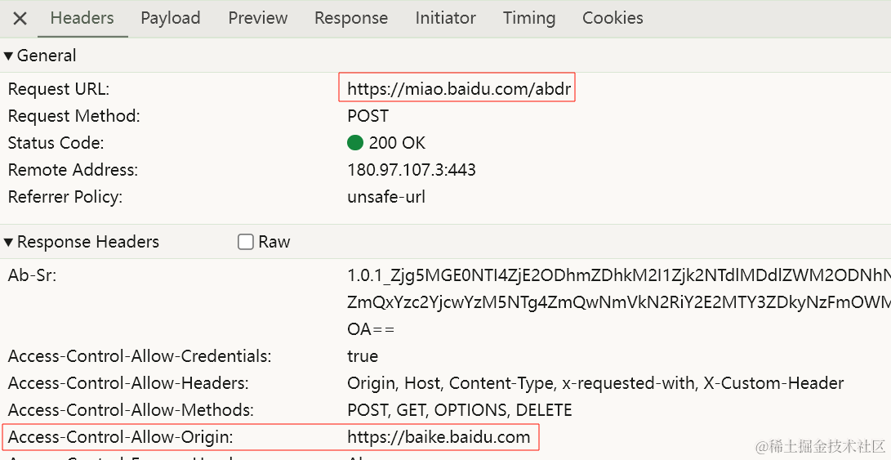

## 什么是构建工具

首先我们要知道浏览器只认识 html，css，js，但在企业级项目中会用到哪些功能？

1. typescript：遇到 ts 文件我们需要使用 tsc 将 ts 代码转为 js 代码
2. React/Vue：安装 react-compiler / vue-compiler，将我们的".jsx" / ".vue"转为 render 函数
3. less/sass/postcss/cpmponent-style：安装 less-loader,sass-loader 等一系列工具
4. 语法降级：babel->将新语法装维旧浏览器支持的语法
5. 体积优化：uglif-js->将代码进行压缩变成体积更小性能更高的文件
6. ...

在上述中我们改一点东西都非常麻烦，有一个东西可以把这些功能都集成，我们只需要关心写代码就好了，只要代码有改动就会自动去执行上述操作，这个东西就叫**构建工具**

**构建工具做了什么?**

1. 模块化开发：支持从 node-modules 里引入代码+多种模块化支持
2. 处理代码兼容性：如 babel 语法降级，sass、ts 语法转换。注：不是构建工具本身的功能，是构建工具将这些语法对应的处理工具集成进来自动化处理
3. 提高项目性能：压缩文件，代码分割
4. 优化开发体验：
   - 建工具会帮你自动监听文件的更新，当文件变化后自动调用对应的集成工具进行重新打包，在浏览器重新运行（热更新 hot replacement）<br>
   - 发服务器：解决跨域问题

总结：构建工具可以让我们不用关心代码在浏览器中如何运行，只需要关心我们的开发怎么写的爽就可以了

## vite 相较于 webpack 的优势

当我们开始构建越来越大型的应用时，需要处理的 JavaScript 代码量也呈指数级增长。包含数千个模块的大型项目相当普遍。基于 JavaScript 开发的工具就会开始遇到性能瓶颈：通常需要很长时间（甚至是几分钟！）才能启动开发服务器，即使使用模块热替换（HMR），文件修改后的效果也需要几秒钟才能在浏览器中反映出来。如此循环往复，迟钝的反馈会极大地影响开发者的开发效率和幸福感。
因为 webpack 支持多种模块化，一开始必须统一模块化代码，所以意味需要将所有依赖读一遍，造成的结果就是 webpack 需要很长的时间才能启动。

## vite 与 vite 脚手架

当我们敲了一个 npm create vite@latest

- 其实是帮我们全局安装了 create-vite（vite 脚手架）
- 直接运行 create-vite bin 目录下的执行配置

在 vite/webpack 项目中，会有 node_modules 文件夹，我们知道浏览器只识别相对路径和绝对路径，为什么 es 官方不在我们导入非相对路径和绝对路径时默认帮我们搜寻 node_modules 呢？

1. 比如当安装了 lodash，那在 lodash 中回依赖其他东西，这样在浏览器运行时就会处理过多的请求，严重降低性能
2. 那为什么 CommonJS 就可以呢，因为 CommonJS 是运行在服务端的（这样找资源就不是通过忘了请求而是通过本地文件）

## vite 的依赖构建

当遇到非相对路径和绝对路径时是怎么处理的呢？

```js
//寻找依赖的过程是自当前目录依次向上查找的过程，直到搜寻到为止。
import _ from "lodash";
import __vite__cjsIport0_lodash from "/node_modules/.vite/deps/lodash.js?v=eb94534";
```

**依赖构建**

vite 会找到对应的依赖，然后调用 esbuild,将其他规范的代码转为 esmodule 规范，再放在当前目录下。同时对 esmodule 规范各个模块进行统一集成<br>
解决了三个问题：

1. 不同的第三方包会有不同的规范
2. 对路径上的处理可以直接使用.vite/deps，方便路径重写
3. 网络多包传输的性能问题（也是原生 esmodule 规范不敢支持 node_modules 的原因之一），有了依赖预构建后，无论有多少 export/import，vite 都会尽量将他们集成为一个或几个模块

## vite 配置

**语法提示**

```js
vite.config.js
//默认写法是没有语法提示的
export default {
    optimizeDeps:{
        exclude:[]//将指定数组中的依赖不进行依赖预构建
    }
}
//加上语法提示
//第一种
import {defineConfig} from "vite"
export default definConfig({
})

//第二种
/** @type {import('vite').UserConfig} */
export default {
}
```

**环境区分**

```js
import { defineConfig } from "vite";
import viteBaseConfig from "./vite.base.config.ts";
import viteDevConfig from "./vite.dev.config.ts";
import viteProdConfig from "./vite.prod.config.ts";
//策略模式
const envResolver = {
  build: () => ({ ...viteBaseConfig, ...viteProdConfig }),
  serve: () => Object.assign({}, viteBaseConfig, viteDevConfig),
};
export default defineConfig(({ command }) => envResolver[command]());
```

**环境变量**

补充：为什么 vite.config.js 可以书写成 esmodule 的形式，是因为 vite 在读取这个文件时会率先 node 去解析文件语法，如果发现是 esmodule 规范就会替换为 CommonJS 规范

在 vite 中的环境变量处理：内置了 dotenv 第三方库，dotenv 会自动读取.env 文件，并解析文件中对应的环境变量并注入到 process（node 内置的进程管理）对象下,但是 vite 考虑到和其他配置文件的冲突问题，不会直接注入到 process 对象下，vite 提供了一些补偿措施：可以调用 vite 的 loadEnv 来手动确认 env 文件

````js
import { defineConfig, loadEnv } from "vite";
import viteBaseConfig from "./vite.base.config.js";
import viteDevConfig from "./vite.dev.config.js";
import viteProdConfig from "./vite.prod.config.js";
/**
 * .env：所有环境都需要用到的环境变量
 * .env.development：开发环境需要用到的环境变量（默认情况下vite将开发环境取名为development）
 * .env.production：生产环境需要用到的环境变量（默认情况下vite将开发环境取名为production）
 * process.cwd()：返回当前node进程的工作目录
 */
/**服务端
 * mode是可以设置的，当我们运行项目时，yarn dev => 其实相当于 yarn dev --mode development，当我们想要更改环境名是就只需要：yarn dev --mode “你需要的环境名”
 * 当我们调用loadEnv是会做以下几件事：
 *  1.直接找到.env文件并解析其中的环境变量放进一个对象里
 *  2.将传进来的mode进行拼接：```.env.development```,并根据提供的目录去解析对应的文件放进一个对象，我们可以理解为：有两个对象 => {...env,...envdevlopment}
 */
/**客户端
 * vite会将对应环境变量注入到import.meta.env中。
 * vite为了防止隐私性的变量直接送到import.meta.env中做了一个拦截，必须是以VITE开头的才会注入其中
 */
//策略模式
const envResolver = {
  build: () => ({ ...viteBaseConfig, ...viteProdConfig }),
  serve: () => Object.assign({}, viteBaseConfig, viteDevConfig),
};
export default defineConfig(({ command, mode }) => {
  // 根据当前工作目录中的 `mode` 加载 .env 文件
  // 设置第三个参数为 '' 来加载所有环境变量，而不管是否有 `VITE_` 前缀。
  // 第二个参数不是必须使用process.cwd()
  const env = loadEnv(mode, process.cwd(), "");
  console.log("//////env", env);
  return envResolver[command]();
});
````

**在 vite 中处理 css**

vite 天生支持对 css 文件的直接处理

1. 在读取.css 文件时会使用 fs 模块去读取.css 文件内容
2. 创建一个 style 标签，将.css 文件中的内容 copy 进 style 标签里
3. 将 style 标签插入到 index.html 的 head 中
4. 将该 css 文件直接替换为 js 脚本（方便热更新或 css 模块化），同时设置 Content-Type 为 javascript，从而让浏览器以 js 脚本的形式来执行 css 后缀的文件

**以上方式在协同开发时就会出现样式覆盖问题（类名重复）,那么怎么解决呢？**

cssmodule 就是用来解决这个问题的，大概原理：

1. 以.module.css 结尾的文件（一种约定，表示开启 css 模块化）
2. 会将所有的类名进行一定规则的替换，同时创建一个映射对象
3. 将替换后的内容写进 style 标签里放入 head 中
4. 将.module.css 结尾的文件的内容全部抹除，替换成 js 脚本
5. 将创建的映射对象在脚本中进行默认导出

**vite.config.js 中的配置**

```js
import { defineConfig } from "vite";
export default defineConfig({
  css: {
    modules: {
      //对css行为进行配置，最后会丢给postcss modules
      localsConvention: "camelCaseOnly", //修改生成的配置对象的key的展示形式（驼峰还是中划线）
      scopeBehaviour: "local", //配置当前的模块化行为是模块化还是全局化，模块化（默认值：local）可以保证有不同的hash值来控制样式类不被覆盖
      generateScopedName: "[name]_[local]_[hash:5]", //生成类名的规则
      // generateScopedName: (name, filename, css) => {
      //   //配置成函数后，返回值就决定了最终显示的类型
      //   return `${name}`;
      // },
      hashPrefix: "hash", //生成hash会根据类名加一些其他字符串去进行生成
      globalModulePaths: [], //代表不想参与到css模块化的路径
    },
    //主要是用来配置css预处理器的一些全局参数
    preprocessorOptions: {
      //key + config key ->预处理器名
      less: {
        math: "always",
        //全局变量，（有一些使用less全局变量的时候会建一个全局变量文件，在要使用的地方进行引入，其实大可不必，可以直接在这里进行配置）
        //在项目中可以新建一个文件定义一个主题样式函数，在这里导入使用即可
        globaVars: {
          mainColor: "red",
        },
      },
    },
    //开启文件索引，这样在报错时可以定位到源文件所在位置
    devSourcemap: true,
    //配置postcss
    postcss: {
      //支持css变量和一些未来的css语法，自动补全
      plugins: [postcssPresetEnv],
    },
  },
});
```

如果你不想在 vite.config.js 文件中配置 postcss，你也新建一个文件来单独配置

```js
//postcss.config.js
const postcssPresetEnv = require("postcss-preset-env");
module.exports = {
  plugins: [postcssPresetEnv],
};
```

**加载静态资源**

除了动态 API 以外，其他基本都被视作静态资源，在 vite 项目中，引入的 json 数据会自动解析为对象，这样我们就可以对 json 数据进行按需引入

**vite 在生成环境对静态资源的处理**

使用过项目中的打包的同学应该都知道，打包后的静态资源是有 hash 的，但是为什么要加这个呢？<br>
首先我们要知道用 hash 的目的：拼上 hash 的字符大概率的是唯一的，浏览器又具有缓存机制（只要文件名不改，那么它就会使用缓存），在 vite 项目中打包时，只要静态资源发生改变这个文件名的 hash 值就会改变，这样就可以让我们更好的去控制浏览器的缓存机制。

**vite 插件**

什么是插件？

插件就是在生命周期的不同阶段去调用不同的插件以达到不同的目的

**手写 vite-aliases 插件**

vite-aliases:可以帮我们自动生成路径别名：检测当前目录下包括 src 在内的所有文件夹，并帮我们去生成别名

```ViteAliases.js
const fs = require("fs");
const path = require("path");
function getTotalSrcDir(keyName) {
  const result = fs.readdirSync(path.resolve(__dirname, "../src"));
  const difdResult = diffDirAndFile(result, "../src");
  const resolveAliasesObj = {};
  difdResult.dirs.forEach((dirName) => {
    const key = `${keyName}${dirName}`;
    resolveAliasesObj[key] = path.resolve(__dirname, `../src/${dirName}`);
  });
  return resolveAliasesObj;
}
function diffDirAndFile(dirFilesArr = [], basePath = "") {
  const result = {
    dirs: [],
    files: [],
  };
  dirFilesArr.forEach((name) => {
    const currentFileStat = fs.statSync(
      path.resolve(__dirname, `${basePath}/${name}`)
    );
    const isDirectory = currentFileStat.isDirectory();
    if (isDirectory) result.dirs.push(name);
    else result.files.push(name);
  });
  return result;
}
module.exports = ({ keyName = "@" } = {}) => {
  return {
    //config：目前的一个配置对象
    config(config, env) {
      const resolveAliasesObj = getTotalSrcDir(keyName);
      //config函数可以返回一个对象，这个对象是部分得viteconfig配置（其实就是想要修改内容）
      return {
        resolve: {
          alias: resolveAliasesObj,
        },
      };
    },
  };
};
```

```vite.config.js
import { defineConfig } from "vite";
import MyViteAliases from "./plugins/ViteAliases";
export default defineConfig({
  plugins: [MyViteAliases()],
});
```

**手写 vite-plugin-html 插件(简单实现)**

```CreateHtmlPlugin.js
module.exports = (options) => {
  return {
    //转换htmnl
    transformIndexHtml: {
      enforce: "pre", //插件提前执行
      transform: (html) => {
        return html.replace(/<%= title %>/g, options.inject.data.title);
      },
    },
  };
};
```

```vite.config.js
import { defineConfig } from "vite";
import MyCreateHtmlPlugin from "./plugins/CreateHtmlPlugin";
export default defineConfig({
  plugins: [MyCreateHtmlPlugin({
      inject: {
        data: {
          title: "主页123",
        },
      },
    })],
});
```

**手写 vite-plugin-mock 插件(简单实现)**

```VitePluginMock.js
const fs = require("fs");
const path = require("path");
function getApis() {
  return new Promise((resolve, reject) => {
    fs.stat("mock", (err, result) => {
      if (err) {
        console.log(err);
        return;
      }
      if (result.isDirectory()) {
        resolve(require(path.resolve(process.cwd(), "mock/index.js")));
      }
    });
  });
}
module.exports = (options) => {
  return {
    configureServer(server) {
      //req：请求对象，res：响应对象，next：是否交给下一个中间件
      server.middlewares.use(async (req, res, next) => {
        const mockResult = await getApis();
        const mockItem = mockResult.find((item) => item.url === req.url);
        if (mockItem) {
          const responseData = mockItem.response(req);
          res.setHeader("Content-Type", "application/json");
          res.end(JSON.stringify(responseData));
        } else {
          next();
        }
      });
    },
  };
};
```

## vite 性能优化

- 开发时的构建速度优化，vite 是按需加载，所以我们不需要考虑。但在 webpack 中就需要我们去下功夫：cache-loader(如果两次构建源代码没有产生变化就使用缓存)，thread-loader，开启多线程去构建...
- 页面性能指标：
  - 首屏渲染时：fcp(first centent paint)
    - 懒加载：代码实现
    - http 优化：强缓存与协商缓存
      - 强缓存：服务器给响应头追加有些字段(expires)，客户端会记住这些字段，在 expires(截至失效时间)之前，不会重新请求，而是从缓存里取
      - 协商缓存：是否使用缓存需与后端商量，当服务器打上协商缓存的标记以后，客户端在下次请求资源时会发送一个协商请求，服务端有变化就会响应该内容，没有变化就会响应 304
  - 页面中最大元素的一个时长：lcp(largest content paint)
- js 逻辑、浏览器层面：
  - 在项目中，当我们使用某些方法时，最好的方式就是使用 lodash 库提供的，因为它的方法都是经过验证的最优的方法。如：防抖、节流等，一般我们自己写的或多或少是不如 lodash 的；再者当我们遍历数组时，当数据过多时，原生的 foeEach 就不如 lodash 的 forEach 方法。
  - 注意副作用的清除，我们知道组件是会频繁的挂载和卸载，如果当我们挂载一个组件时设置了一个 setTimeout，如果我们在组件卸载时没有清除，组件再次挂载时会再开一个 setTimeout，这就开启了两个线程
  - 写法上的注意事项：requestIdleCallback,requsetAnimationFrame，这需要我们对浏览器渲染原理有一定的认识
    - requestIdleCallback：传入一个函数，他会在浏览器的帧率空闲时去执行，浏览器的帧率说 16.6ms 去更新一次（执行 js 逻辑，重排，重绘...），做完一系列事情后有时间就会去执行。

```js
const arr = [];
//js取值是由近到远，下面的写法就不会频繁的去读取父级的
for (let i = 0, len = arr.lehgth; i < len; i++) {}
```

- css：
  - 关注继承属性：能继承的就不要重复书写
  - 尽量避免太过于深的 css 嵌套
- 构建优化：vite(rollup) webpack
  - 体积优化：压缩，treeshaking，图片资源压缩，cdn 加载，分包...

**分包策略**

分包就是把一些不会常规更新的文件进行单独打包处理

```vite.config.ts
import { defineConfig } from "vite";
import path from "path";
export default defineConfig({
  build: {
    minify: false,
    rollupOptions: {
      input: {
        main: path.resolve(__dirname, "./src/main.ts"),
        product: path.resolve(__dirname, "./src/product.ts"),
      },
      output: {
        manualChunks: (id: string) => {
            //对node_modules进行分包
          if (id.includes("node_modules")) {
            return "vendor";
          }
        },
      },
    },
  },
});
```

**gzip 压缩**

有时候我们的文件资源实在是太大了，就需要将所有的静态文件进行压缩，以达到减少体积的目的
gzip(vite-plugin-compression)：当我们进行发布时会将.gz 的文件一起给到运维，当浏览器请求的文件是有.gz 时就返回.gz 文件，浏览器收到响应结果发现响应头里有 gzip 对应字段就会进行解压得到原本的 js 文件（浏览器时要承担一定的解压时间），如果体积不是很大，不要使用 gzip 压缩。

**动态导入**

动态导入是 es6 的新特性

**cdn 加速**

content delivery network：内容分发网络

将我们依赖的第三方模块全部写成 cdn 的形式，然后保证我们自己代码的一个小体积

```vite.config.ts
import { defineConfig } from "vite";

import viteCDNPlugin from "vite-plugin-cdn-import";
export default defineConfig({
  plugins: [
    viteCDNPlugin({
      modules: [
        {
          name: "lodash",
          var: "_",
          path: "https://cdn.jsdelivr.net/npm/lodash@4.17.21/lodash.min.js",
        },
      ],
    }),
  ],
});
```

**vite 跨域**

同源策略【仅在浏览器发生】：http 交互默认情况下只能在同协议同域名同端口的两台终端进行

跨域：当 A 源浏览器的网页向 B 源的服务器地址（不满足同源策略，满足同源限制）请求对应信息就会产生跨域，跨域默认情况下会被浏览器拦截（**跨域限制是服务器已经响应了内容，但是浏览器不会给你，不是服务器没有响应内容**），除非对应的请求服务器标记这个 A 源是允许拿 B 以源的东西。

**开发时态**：

一般我们利用构建工具、脚手架、第三方库的 proxy 代理，或者自己搭一个开发服务器

**生产时态**：

一般都不存在跨域问题，通常前端代码和后端服务都是放在一个域下面，也有跨域情况(跨部门)比如：百度百科：https://baike.baidu.com/ ，百度文库：https://wenku.baidu.com/ ，但是我们的用户信息：https://baidu.com/api/userInfo ,他们的总公司是同一个，用户信息也存放在总公司，部门到总公司就会产生跨域

- ngnix：代理服务
- 配置身份标记 - Access-Control-Allow-Origin：表示服务器可以接受所有的请求源

  

```vite.config.ts
import { defineConfig } from "vite";
export default defineConfig({
  //开发服务器中的配置
  server: {
    //配置跨域解决方案
    proxy: {
      //key + 描述对象 在遇到/api开头的请求时都会将其代理到target属性对应的域中去
      "/api": {
        target: "https://www.baidu.com",
        changeOrigin: true,
        rewrite: (path) => path.replace(/^\/api/, ""),
      },
    },
  },
});
```
