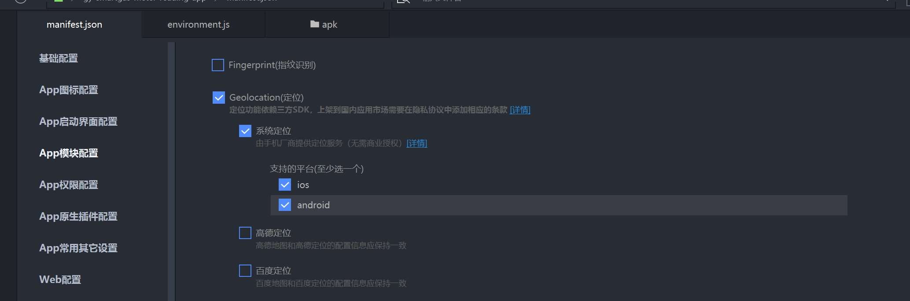
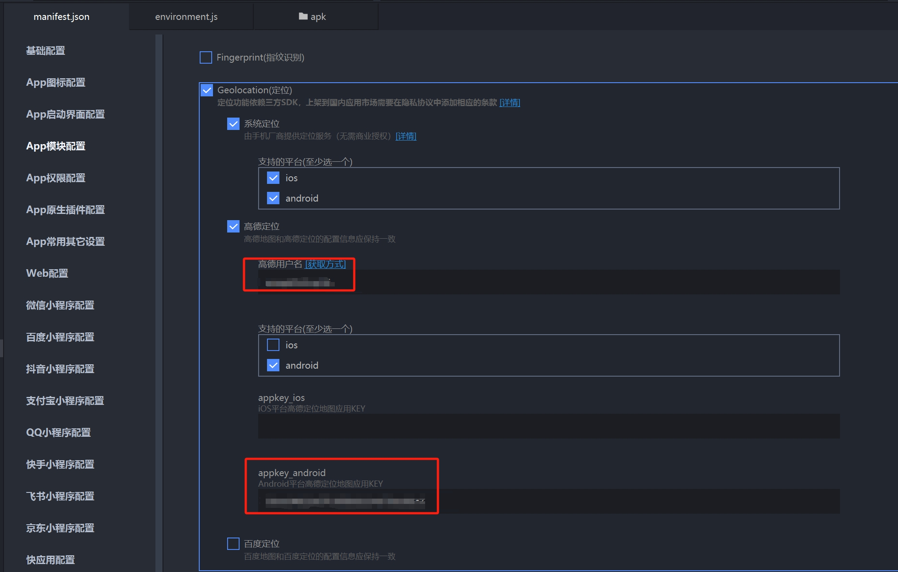
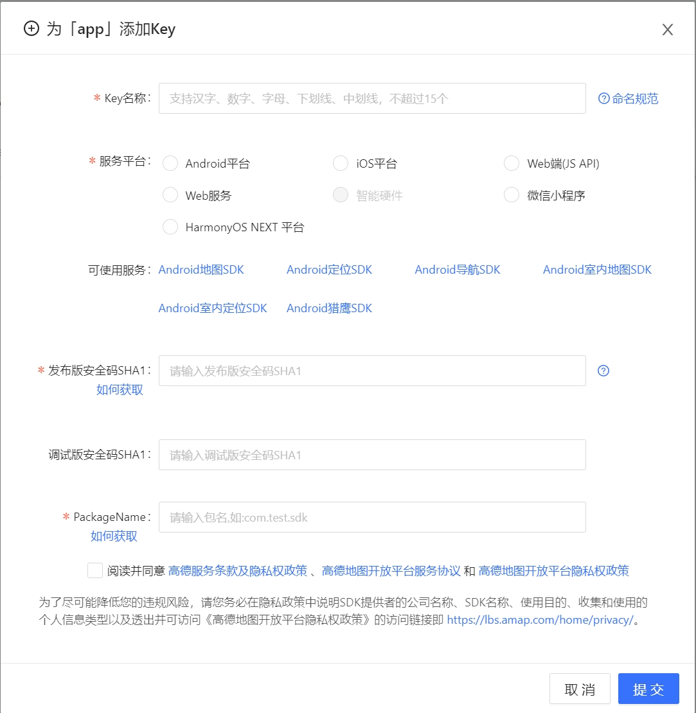
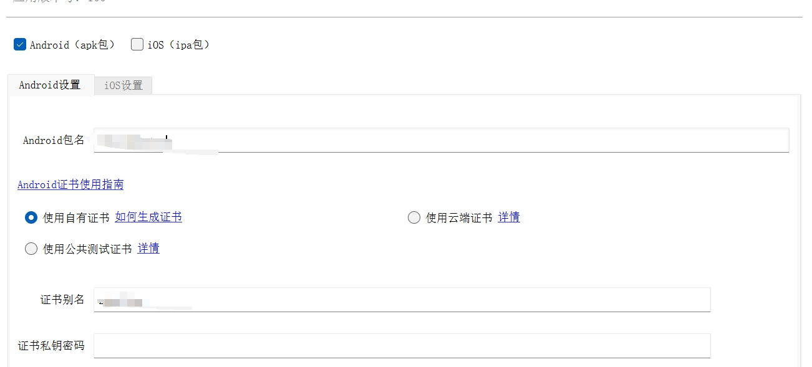
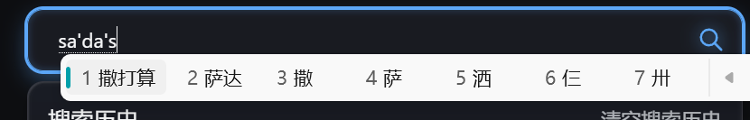

- 插件开发 dns预解析
- 使用avif图片格式：
  - 处理动态资源：腾讯方案：内容协商技术：通过统一的url去区分不同的资源，在请求头设置：accept:image/avif,image/webp,image/apng,image/svg+xml,image/*,*/*;q=0.8
  - 静态资源（public中）：图片统一使用`avif`格式，在处理静态资源时也可以加上这个accept请求头，虽然静态文件的请求通常是直接返回的，但服务器仍然可以根据 Accept 头来优化响应。


## vue2加了属性丢失样式
>场景：封装了一个loading组件 默认先显示loading效果，一秒后显示正文，在给封装的组件的展示loading的div标签上加上一些属性，会导致正文的样式没有命中而导致样式丢失。
```vue
<template>
  <div>
    <template v-if="loading">
      <div>//这里的div没有属性就不会导致样式丢失
      <slot name="loading"></slot>
      </div>
      <div :key="a" :a="1">//这里的div添加了a属性 就会导致样式丢失 原因是丢失了scopeid，因为vue这里是使用了被隐藏的div的vnode，加上key就可以解决这个问题
        <slot name="loading"></slot>
      </div>
    </template>
  </div>
</template>
```
到这里这个问题就已经解决了，但是想要知道为什么 就需要看vue的源码

**源码**

先把项目使用版本的vue源码拉下来，但是源码的文件有很多，我们怎么定位我们想要的方法呢？ 这里就可以使用一个vscode插件CodeGeex，
使用workspace功能进行搜索，比如：这个项目的哪个方法负责v-if变换的时候更新页面dom，当进行这个搜索时，他会提示你v-if的更新是由vue
的虚拟dom diff算法处理的，所有我们可以问他dom diff算法在哪里，找到我们想要的看的方法，怎么进行调试呢？我们可以在源码所在位置找一个比较唯一的注释，
然后我们去到网页中去到network选项，使用ctrl+shift+f在search中搜索刚刚复制的注释就能找出调试位置进行断点调试，本次的这个问题在调试发现一个setScope方法，
这个方法是用来设置scopeid，继续看有发现了一个sameVode方法，里面有很多判断条件，我们一个一个看，其中一个判断isDef(a.data) === isDef(b.data)，
这个方法是判断有没有a.data和b.data，所以我们只要写了一个属性他就会有，这样这整个判断就会返回true然后上传的判断过了就会公用虚拟节点，这个节点就是组件中的节点，
因为这个组件本身他是没有写`<style scoped>`，使用组件的页面就会使用这个公用节点

## uniapp打包定位失效

> 问题描述：在使用 uniapp 开发 app 时，发现真机调试时定位没有问题，打包上线后定位功能失效。



当`manifest.json`使用如上配置时，系统定位在打包后并没有生效，这里使用的是高德定位对安卓 app 进行处理



如上图所示，我们需要用到高德用户名和相关 key，在这里我们需要在[高德开放平台](https://lbs.amap.com/)申请`appkey_android`，在控制台=>我的应用中添加相关的 key





这里使用的是原生 APP 云打包。

- key 的名称可以随便取
- 服务平台根据自己的需求添加
- 发布版本安全码 SHA1：点击[如何获取](https://lbs.amap.com/faq/android/map-sdk/create-project/43112)，进入后这里需要安装 java jdk，配置好全局变量后，在证书文件（.keystore）所在的文件下打开`cmd`窗口输入`keytool -list -v -keystore zqt.keystore`后，再输入证书密码（对应证书私钥密码），就可以获取到`SHA1`码。
- PackageName：对应打包时的包名（这里就是 Android 包名）。

## 中文输入法导致的高频事件
>场景：根据输入框的内容去后台进行模糊查询便于用户选择，实现：直接监听输入框的input事件进行模糊查询，在这种方式下英文是没有问题的，但是中文就会有bug，在输入过程中就触发了查询，这显然是不行的。


这里就需要使用合成事件`compositionstart` `compositionend`
```html
<!DOCTYPE html>
<html lang="en">
<head>
    <meta charset="UTF-8">
    <title>Title</title>
</head>
<body>
<input type="text">

<script>
    let isCompleted = false;
    const input = document.querySelector('input');
    function search() {
        console.log('inputvalue===>', input.value)
    }
    input.addEventListener('input',()=>{
        if (isCompleted) return
        search()
    })
    input.addEventListener('compositionstart',()=>{
        console.log('开始')
        isCompleted = true
    })
    input.addEventListener('compositionend',()=>{
        console.log('结束')
        isCompleted = false
        search()
    })
</script>
</body>
</html>
```

## 大文件上传
>分片+多线程
```js
//main.js
const input = document.querySelector('input[type="file"]');
input.onchange = async function (e) {
    const file = e.target.files[0]
    console.time('chunks')
    const chunks = await cutFile(file)
    console.timeEnd('chunks')
    console.log(chunks)
}
//设置分片大小 1M
const CHUNK_SIZE = 1024 * 1024
//获取线程
const THREAD_COUNT = navigator.hardwareConcurrency || 4
function cutFile(file) {
    return new Promise(resolve => {
        //分为多少片
        const chunkCount = Math.ceil(file.size / CHUNK_SIZE)
        //每个进程的片数
        const threadCount = Math.ceil(chunkCount / THREAD_COUNT)
        //总分片数
        const result = []
        //已经完成的次数
        let finishCount = 0
        for (let i = 0; i < THREAD_COUNT; i++) {
            const worker = new Worker('./worker.js',{
                type:'module'
            });
            const start = i * threadCount
            //超出边界处理
            let end =(i + 1) * threadCount
            if (end > chunkCount)  end = chunkCount
            worker.postMessage({
                file,
                CHUNK_SIZE,
                start,
                end
            })
            worker.onmessage = (e) => {
                //按照顺序添加
                for (let i=start; i < end; i++) {
                    result[i] = e.data[i - start]
                }
                worker.terminate()
                finishCount++
                //判断所有线程是否完成
                if (finishCount === THREAD_COUNT){
                    resolve(result)
                }

            }
        }
    })
}
```
```js
//worker.js
function createChunk(file,index,size) {
    return new Promise((resolve, reject) => {
        const start = index * size
        const end = start + size
        const fileReader = new FileReader()
        const blob = file.slice(start, end)
        fileReader.onload = (e)=>{
            resolve({
                start,
                end,
                index,
                blob
            })
        }
        fileReader.readAsArrayBuffer(blob)
    })
}
onmessage = async function (e) {
    const {
        file,
        CHUNK_SIZE,
        start,
        end
    } = e.data
    const proms =[]
    for (let i = start; i < end; i++) {
        proms.push(createChunk(file,i,CHUNK_SIZE))
    }
    const chunks = await Promise.all(proms)
    postMessage(chunks)
}
```

## 封装分时函数
>场景：在页面插入20000个元素而不卡顿
```html
<!DOCTYPE html>
<html lang="en">
<head>
    <meta charset="UTF-8">
    <title>Title</title>
</head>
    <body>
        <button class="btn">开始插入</button>

        <script>
            const tasks = Array.from({length:20000},(_,i)=> ()=>{
                const div = document.createElement("div")
                div.innerHTML = i + ''
                document.body.appendChild(div)
            })
            const btn = document.querySelector('.btn');
            btn.onclick = ()=>{
                const sheduler =(chunkTask)=>{
                    setTimeout(()=>{
                        const now = performance.now()
                        chunkTask(()=>(performance.now()- now < 1))
                    },1000)
                }
                idlePerformTasks(tasks)
            }
            function performTasks(tasks,sheduler) {
                if (tasks.length === 0) return
                let i = 0
                function run() {
                    sheduler((goOn)=>{``
                        while(i < tasks.length && goOn() ){
                            tasks[i++]()
                        }
                        run()
                    })
                }
                run()
            }
            function idlePerformTasks(tasks) {
                const sheduler =(chunkTask)=>{
                    requestIdleCallback((idle)=>{
                        chunkTask(()=> (idle.timeRemaining() > 0))
                    })
                }
                performTasks(tasks,sheduler)

            }
        </script>
    </body>
</html>
```


## 接口请求顺序和返回顺序不一致

>场景：在单页应用中，用户连续点击表格的分页页码，会导致展示的数据与对应页数的内容不一致。使用echarts图表时，连续点击查询会导致出现多组数据。

**解决办法**

- 取消上次的请求接口
- 在请求时添加一个requestId，返回时后端会返回对应的id，根据这个id进行判断（需要后端改动）

```ts
//基于axios封装取消上次请求
const http = axios.create({
    baseURL: config.env?.apiUrl,
    timeout: 120000
})
interface ControllerConfig {
    controller: AbortController;
    url: string;
}
let controllers:ControllerConfig[] = []
http.interceptors.request.use(
    config => {
        if (controllers.length > 0) {
            controllers = controllers.filter(cfg => {
                if(config.url === cfg.url){
                    cfg.controller.abort()
                    return false
                }
                return true
            })
        }
        const controller = new AbortController()
        config.signal = controller.signal
        controllers.push({controller,url:config.url!})
        return config
    },
    err => {
        return Promise.reject(err)
    }
)
http.interceptors.response.use(
    async response => {
        controllers = controllers.filter(cfg => response.config.url === cfg.url)
        return response
    },
    err => {
        return Promise.reject(err)
    }
)
```

## 图片预加载

场景：H5 页面，用户在点击 Tab 不同位置时，需要切换对应 Tab 容器的背景图。

使用`requestIdleCallback`与`window.onload`实现

```javascript
function autoPreloadImages() {
  // 使用 require.context 动态获取指定文件夹及其子文件夹下的所有图片
  // require.context(目录, 是否递归, 匹配文件的正则表达式)
  const files = require.context('../../assets/img', true, /^./.*pre-.*.(png|jpe?g|gif|webp)$/i);

  // 调用 files.keys() 获取匹配的文件路径数组，并通过 files(key) 获取每个文件的实际 URL
  const urls = files.keys().map(key => files(key));

  // 检查浏览器是否支持 requestIdleCallback 方法
  if ('requestIdleCallback' in window) {
    requestIdleCallback(() => {
      preloadImages(urls);
    });
  } else {
    // 如果浏览器不支持 requestIdleCallback，则使用 window.onload 事件作为后备方案
    window.addEventListener('load', event => {
      preloadImages(urls);
    });
  }

  // 定义图片预加载函数
  function preloadImages(urls) {
    urls.forEach(url => {
      const img = new Image();
      img.src = url;
    });
  }
}
```

## 手写 promise

```js
const PENDING = "pending";
const FULFILLED = "fulfilled";
const REJECTED = "rejected";
//添加到微任务
function runMicrotask(fn) {
  if (typeof queueMicrotask === "function") {
    queueMicrotask(fn);
  } else if (
    typeof process === "object" &&
    typeof process.nextTick === "function"
  ) {
    //node环境
    process.nextTick(fn);
  } else if (typeof MutationObserver === "Object") {
    const text = document.createTextNode("");
    const observer = new MutationObserver(fn);
    observer.observe(text, {
      characterData: true,
    });
    text.textContent = "1";
  } else {
    setTimeout(fn);
  }
}
class MyPromise {
  #state = PENDING;
  #value;
  #handlers = [];
  constructor(executor) {
    const resolve = (v) => {
      this.#setState(FULFILLED, v);
    };
    const reject = (v) => {
      this.#setState(REJECTED, v);
    };
    try {
      executor(resolve, reject);
    } catch (error) {
      reject(error);
    }
  }
  #setState(state, value) {
    if (this.#state !== PENDING) return;
    this.#value = value;
    this.#state = state;
    if (this.#handlers.length){
        this.#runTask()
    }
  }
  #runTask() {
    runMicrotask(() => {
      this.#handlers.forEach((cb) => cb());
      this.#handlers = [];
    });
  }
  then(onFulfilled, onRejected) {
    return new MyPromise((resolve, reject) => {
      this.#handlers.push(() => {
        const cb = this.#state === FULFILLED ? onFulfilled : onRejected;
        const res = typeof cb === "function" ? cb(this.#value) : this.#value;
        //判断是否是是promise
        if (typeof res?.then == "function") {
          res.then(resolve, reject);
        } else {
          resolve(res);
        }
      });
      if (this.#state !== PENDING) {
        this.#runTask();
      }
    });
  }
  //catch方法不是promise a+规范 而是es6
  catch(onRejected) {
    return this.then(null, onRejected);
  }
}

const p = new MyPromise((resolve, reject) => {
  reject("完成");
});
```

## 性能优化

### 1、图像格式

- 处理动态资源：腾讯方案：内容协商技术：通过统一的url去区分不同的资源，在请求头设置：accept:image/avif,image/webp,image/apng,image/svg+xml,image/*,*/*;q=0.8
- 静态资源（public中）：图片统一使用`avif`格式，在处理静态资源时也可以加上这个accept请求头，虽然静态文件的请求通常是直接返回的，但服务器仍然可以根据 Accept 头来优化响应。

### 2、启用前端缓存<a id="id1"></a>

缓存范围：有哈希值的文件设置强缓存即可。没有哈希值的文件（比如 index.html）设置协商缓存，缓存主要针对静态资源

缓存可以解决的问题

- 减少不必要的网络传输，节约带宽。
- 更快的页面加载速度。
- 减少服务器负载。

缺点：占内存（有些缓存会被存到内存中）

### 强制缓存（强缓存）基于 Cache-control<a id="id2"></a>

浏览器判断请求的目标资源有效命中强缓存，如果命中，则可以直接从内存中读取目标资源，无需与服务器做任何通讯

`Cache-control`的属性：

- max-age 客户端资源的缓存时长。
- s-maxage 代理服务器的缓存时长。
- no-cache 表示是强制进行协商缓存。
- no-store 是表示禁止任何缓存策略。
- public 表示资源即可以被浏览器缓存也可以被代理服务器缓存。
- private 表示资源只能被浏览器缓存。

注：public 表示资源在客户端和代理服务器都可以被缓存，private 则表示资源只能在客户端被缓存，拒绝资源在代理服务器缓存，如果这两个属性值都没有被设置，则默认为 private，public 和 private 也是一组互斥属性。他们两个不能同时出现在响应头的 cache-control 字段中。

### 协商缓存 （ETag）<a id="id3"></a>

实现协商缓存就需要设置`no-cache`

`ETag`是通过比较指纹（文件的唯一哈希值）实现协商缓存

流程：

- 第一次请求某资源的时候，服务端读取文件并计算出文件指纹，将文件指纹放在响应头的 etag 字段中跟资源一起返回给客户端。
- 第二次请求某资源的时候，客户端自动从缓存中读取出上一次服务端返回的 ETag 也就是文件指纹。并赋给请求头的 if-None-Match 字段，让上一次的文件指纹跟随请求一起回到服务端。
- 服务端拿到请求头中的 is-None-Match 字段值（也就是上一次的文件指纹），并再次读取目标资源并生成文件指纹，两个指纹做对比。如果两个文件指纹完全吻合，说明文件没有被改变，则直接返回 304 状态码和一个空的响应体并 return。如果两个文件指纹不吻合，则说明文件被更改，那么将新的文件指纹重新存储到响应头的 ETag 中并返回给客户端

### 3、开启 GZIP 压缩

这里以`vite+vue`项目为例

安装插件

```sh
npm install vite-plugin-compression --save-dev
```

配置

```ts
// vite.config.ts
import { defineConfig } from "vite";
import vue from "@vitejs/plugin-vue";
import compression from "vite-plugin-compression";

export default defineConfig({
  plugins: [
    vue(),
    compression({
      // 压缩算法，可以选择 'gzip' 或 'brotli'
      algorithm: "gzip",
      // 是否压缩所有文件，默认值为 false
      verbose: true,
      // 只压缩超过这个大小的文件，单位为字节
      threshold: 10240,
      // 最小文件大小
      minRatio: 0.8,
    }),
  ],
});
```

以上配置完成后要确保你所用的服务器能正确处理 gzip 文件

### 4、代码层面

- 使用函数节流和函数防抖
- 减少重排和重绘
- 尽量使用 CSS 完成动画效果
- 使用懒加载、骨架屏
- ......

## 大屏自适应方案
>主要有两种：1、基于scale进行缩放。2、vw和vh适配

**scale**
```html
<!DOCTYPE html>
<html lang="en">
<head>
    <meta charset="UTF-8">
    <meta name="viewport" content="width=device-width, initial-scale=1.0">
    <title>Responsive Scale</title>
    <style>
        html, body {
            margin: 0;
            height: 100%;
        }
        #app {
            width: 100%;
            height: 100%;
            background-color: gray;
            display: flex;
            justify-content: center;
            align-items: center;
        }
        .box {
            height: 200px;
            width: 200px;
            background-color: skyblue;
            transform-origin: top left; /* 设置缩放的基点 */
        }
    </style>
</head>
<body>

<div id="app">
    <div class="box"></div>
</div>

<script>
    function autoScale(selector, options) {
        const element = document.getElementById(selector);
        const { width, height } = options;

        function init() {
            const scaleX = innerWidth / width;
            const scaleY = innerHeight / height;
            const scale = Math.min(scaleX, scaleY);
            element.style.transform = `scale(${scale})`;
        }

        init();
        addEventListener('resize', init);
    }
    autoScale('app', {
        width: 1920,
        height: 1080
    });
</script>
</body>
</html>
```

**vw和vh适配**

>按照设计稿的尺寸将`px`按比例计算为`vw`和`vh`，这种方式比scale的工作量大一点

```scss
//假设设计稿的尺寸为1920*1080，div元素为300px*200px
//计算方式：
//vw=(300px / 1920px) * 100vw
//vh=(200px / 1080px) * 100vh
//在scss中实现
 
@use 'sass:math';
$designwidth: 1920;
$designheight: 1080;

@function vw($px) {
  @return math.div($px, $designwidth) * 100vw;
}
.container {
  width: vw(300); 
  height:vh(200)
}
```

## 首屏、白屏与卡顿优化

### 首屏秒开

>首屏秒开主要可以分为 4 个方法——懒加载，缓存，离线化，并行化。

#### 懒加载

>懒加载是指在长页面加载过程时，先加载关键内容，延迟加载非关键内容

- 使用原生API `Intersection Observer`实现只加载可视区域，`Lazy Loading`,实现图片和`iframe`懒加载
- 使用第三方插件 `vue-lazyload`进行懒加载，`vue-infinite-scroll`实现无限滚动加载更多内容
- 原生事件监听滚动事件加`v-if`或`v-show`，动态导入加载组件或模块

#### 缓存

- 接口缓存：对于不常变的数据可以做本地缓存，比如一些配置接口。同时还可以进行版本号管理，后端返回数据时同时返回版本号，在数据发生变更时（可以使用监听机制），后端将版本号更新。前端请求时携带之前拿到的版本号，如果版本号一致，后端直接返回无变化，不用再查数据库。
- 静态资源缓存：[启用前端缓存](#id1)   [强缓存](#id2)   [协商缓存](#id3)

#### 离线化

>离线化是指线上实时变动的资源数据静态化到本地，打包构建时预渲染页面，前端请求落到 index.html 上时，已经是渲染过的内容。

基于构建工具不同
- 在vite中，可以使用`vite-plugin-pwa`插件，配置完成打包后会生成`Service Worker`文件，在项目的入口文件收纳注册`Service Worker`
- 在webpack中，可以使用`workbox-webpack-plugin`或`prerender-spa-plugin`，`workbox-webpack-plugin`和vite的配置使用基本一致，`prerender-spa-plugin`需要配置预渲染的路由，它的主要目的是提升 SEO 和首屏加载性能，但它也可以用于实现某种程度的 离线化，尤其是在静态资源预渲染到本地的场景下。

#### 并行化

>懒加载、缓存和离线化都是在请求本身上下功夫，想尽办法减少请求或者推迟请求，并行化则是在请求通道上功夫，解决请求阻塞问题，进而减少首屏时间。

- 使用 HTTP/2，HTTP/2 支持多路复用（Multiplexing），可以在一个 TCP 连接上并行传输多个请求和响应，减少延迟。
- 代码逻辑上，能并行的逻辑尽量并行处理，如使用Promise.all()。

### 白屏优化

>所谓白屏时间，一般是当用户打开一个页面，从开始等待到页面第一个字符出现的时间。我们可以基于影响白屏时间长短的两个主要因素来解决——DNS 查询和首字符展示。

#### DNS 查询优化

>通过在页面中加入 dns-prefetch，在静态资源请求之前对域名进行解析，从而减少用户进入页面的等待时间。

```html
<meta http-equiv="x-dns-prefetch-control" content="on" />
<link rel="dns-prefetch" href="https://s.google.com/" >
```
`x-dns-prefetch-control`（在现代浏览器中都是默认开启的） 表示开启 DNS 预解析功能，`dns-prefetch` 表示强制对域名做预解析。这样在资源请求开始前，DNS 解析完成，后续请求就不需要重复做解析了。

#### 字符展示优化

- 使用loading图，但是体验稍差。
- 使用骨架屏，可以使用切图，但是可能整页切图质量较大，也会占用网络资源，参考社区自动化方案如`page-skeleton-webpack-plugin`。

## 


